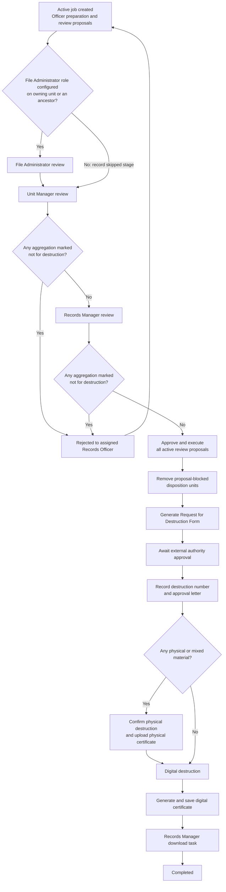

# Destruction Process — Disposition Extension Specification

**Status:** Discussion draft — no implementation authorized
**Prepared:** 7 October 2026
**Project:** ERMS / Wathiq
**Revision:** 0.18

## Revision history

| Revision | Date | Summary |
| --- | --- | --- |
| 0.1 | 6 October 2026 | Initial destruction-process extension covering reminders, job ownership, internal review and approval, the external request, approval evidence, physical and digital destruction, and destruction certificates |
| 0.2 | 6 October 2026 | Clarified relationship admission versus final-destruction blockers, review UI, and checks before physical and digital destruction |
| 0.3 | 7 October 2026 | Added staged review proposals for vital status, disposition-blocking security, legal holds, aggregation relationships, and local retention overrides; deferred their execution until Records Manager approval; and required proposal-caused blockers to be removed before generating the external request |
| 0.4 | 7 October 2026 | Defined the disposition task inbox, role-queue claiming, common destruction-job workspace, task-specific forms, review-proposal presentation, asynchronous progress, and completion notifications |
| 0.5 | 7 October 2026 | Defined the destruction-specific logical data model for review proposals and effects, external approval, physical confirmation, asynchronous destruction, manifests, reminders, configuration, and protected operations; shared workflow tables remain defined by the common disposition specification |
| 0.6 | 7 October 2026 | Designated each organizational unit's File Administrator role through `org_units.file_administrator_role_id`, with same-unit, active, non-system role validation and role-queue routing |
| 0.7 | 7 October 2026 | Allowed a destruction job to inherit its effective File Administrator role from the nearest ancestor organizational unit when its owning unit has no valid File Administrator, without adding an inheritance-control setting |
| 0.8 | 7 October 2026 | Made File Administrator review conditional: skip it when neither the owning unit nor any ancestor has configured the role, but block routing when the nearest configured role cannot be used; clarified that inherited routing never grants access to descendant content |
| 0.9 | 7 October 2026 | Resolved Unit Manager identification through the authoritative `org_units.managing_role_id` defined by the Hierarchical Oversight Default ACLs security extension |
| 0.10 | 8 October 2026 | Documented why an unconfigured File Administrator review is skipped, while a configured but unusable role blocks submission |
| 0.11 | 8 October 2026 | Included Information Governance Managers alongside Information Governance Officers as destruction-eligibility reminder recipients |
| 0.12 | 8 October 2026 | Clarified that the notification contains no aggregation metadata, while the eligibility listing displays metadata and blocking information subject to access rights |
| 0.13 | 8 October 2026 | Allowed an active, empty job's owning unit to change only before its first submission to File Administrator or Unit Manager review |
| 0.14 | 8 October 2026 | Added proposals to remove existing named aggregation relationships, with deferred execution, relationship identity, authorization, and verification requirements |
| 0.15 | 8 October 2026 | Made individual governance-proposal reasons optional and required an overall job reason on each Records Officer submission |
| 0.16 | 8 October 2026 | Allowed a successor assigned Records Officer to revise their predecessor's proposals during preparation or correction, preserving original attribution and every revision |
| 0.17 | 8 October 2026 | Added attributed free-text instructions, observations, and recommendations for Records Officers and all review participants, visible to subsequent reviewers and preserved in history |
| 0.18 | 8 October 2026 | Named the shared free-text field Review notes |

## 1. Purpose and authority

This specification extends the approved
[Disposition — Product and Technical Specification](disposition.md) for jobs
of type **destruction**. The common specification remains authoritative for
eligibility, blockers, job membership, status propagation, termination,
partially disposed units, authorization, audit, and metadata retained after
destruction.

This extension defines what happens after eligible aggregations are selected
for a destruction job. It does not govern permanent transfer, selective
transfer, or retention as local archives.

If this extension conflicts with the common specification, the common
specification controls unless an explicit amendment to that approved
specification is separately approved.

For aggregation and record relationship blockers and their disposition-review
UI, see [Record and Aggregation Relationships, section 7](record-and-aggregation-relationships.md#7-disposition).

## 2. People and terms

### 2.1 Records Officer

A person with a currently effective information-governance role whose profile
is **Information Governance Officer** (`INFO_GOV_OFFICER`) and that supplies
`disposition.jobs.manage`.

The Records Officer creates and prepares destruction jobs, is assigned to a
job, responds to rejected reviews, records the external authority's destruction
number, and uploads its approval letter.

### 2.2 File Administrator

A person with a currently effective assignment to the destruction job's
effective File Administrator role. Wathiq determines that role by checking the
job's owning organizational unit first. If that unit has not configured a File
Administrator role, Wathiq moves upward through the organizational hierarchy
and uses the role configured on the nearest ancestor. A role configured
directly on the owning unit therefore takes precedence over every ancestor
role.

Wathiq identifies each configured role through the organizational unit's
`file_administrator_role_id`. It must not route work by comparing a translated
or editable role display name or by assuming that one particular profile
always identifies this organizational responsibility. Inheritance changes who
may perform the File Administrator task; it does not change the job's owning
organizational unit.

This routing rule does not give the File Administrator permission to view
records owned by descendant units. Existing access and security rules still
apply. The organization is responsible for giving an inherited File
Administrator the access needed to review those records.

### 2.3 Unit Manager

A person with a currently effective assignment to the managing role of the
destruction job's owning organizational unit. Section 17.1 identifies the
approved source of that designation.

### 2.4 Records Manager

A person with a currently effective information-governance role whose profile
is **Information Governance Manager** (`INFO_GOV_MGR`) and that supplies
`disposition.jobs.manage`.

### 2.5 External archival authority

The authority outside Wathiq that receives the Request for Destruction Form and
decides whether to approve destruction. Its deliberation and decision-making
process are outside Wathiq.

### 2.6 Lifecycle state and workflow stage

The job lifecycle state remains one of **active**, **completed**, or
**terminated**, as defined by the common specification. A workflow stage shows
which task is currently required inside an active destruction job. Workflow
stages do not add more lifecycle states.

## 3. Destruction-eligibility reminder

Wathiq registers a system-notification producer for destruction eligibility.
Its initial interval is six calendar months. An authorized administrator may
configure the interval without changing this specification.

At each interval, Wathiq checks whether at least one governing root is in
status 2, **Eligible for destruction**. When eligible work exists, Wathiq sends
one notification to each active person who has a currently effective
information-governance role using either the `INFO_GOV_OFFICER` or
`INFO_GOV_MGR` profile and supplying `disposition.jobs.manage`. A person who
qualifies through both profiles still receives only one notification per
scheduled interval.

The notification tells recipients that aggregations are eligible for
destruction and links to the server-paginated eligibility listing. The
notification itself contains no aggregation metadata. The listing displays
the metadata and blocking information defined in Section 4, subject to the
recipient's access rights.

The reminder uses Wathiq's system-notification framework. Recipient resolution,
the eligibility check, and the durable reminder checkpoint use committed
database state. Retries, overlapping workers, and restarts must not create more
than one notification for the same person and scheduled interval. No reminder
is sent for an interval in which no eligible destruction aggregation exists.

Changing the interval affects future schedules and does not send historical
reminders. Disabling the configured producer stops reminders but does not
disable the eligibility listing or destruction workflow.

## 4. Eligible-destruction listing

Records Officers use the eligibility listing defined by the common
specification, filtered to status 2. Its pagination, sorting, blocker display,
redaction, selection, and current-state rechecking rules continue to apply.

## 5. Creating and filling a destruction job

### 5.1 Owning organizational unit

Every destruction job has exactly one `owning_org_unit_id`. Every root
aggregation added to that job must currently be owned by that organizational
unit. Wathiq rejects a non-matching aggregation without changing it or the job.

The Records Officer chooses the owning organizational unit when creating the
job. The job becomes active immediately, as required by the common
specification. It may be unassigned only while empty and must be assigned to one
specific Records Officer before its first aggregation is added.

The job's owning organizational unit may be changed only when all three
conditions are met:

- the job is active;
- the job contains no aggregations;
- the job has never been sent to a File Administrator or Unit Manager for
  review or approval.

Adding aggregations and then removing all of them does not prevent an owning
unit change if these conditions still hold. Once the job has been sent to
either reviewer, its owning unit cannot change, even if all aggregations are
later removed or the job returns to the Records Officer for correction. The
change and the previous and new owning units are recorded in the job's event
history. On submission, reviewer routing uses the job's current owning unit.

### 5.2 Addition and initial stage

Adding an aggregation follows the common specification and changes the whole
disposition unit from status 2 to status 6, **Pending destruction**. Common
admission blockers and the one-active-job rule apply. Aggregation and record
relationships do not prevent addition. Outside-job links mark the admitted unit
as blocked from final destruction without changing its membership or pending
status, even if the related unit is eligible. Units in different jobs or with
no active job are outside-job; units in the same job are not.

Records Officer and Records Manager review screens must show relationship
blockers and the **Relationships within this job** summary and table defined in
[Record and Aggregation Relationships, section 7](record-and-aggregation-relationships.md#7-disposition).
Links within one disposition unit or between units in the same job are visible
but non-blocking and need not be removed. Links to units outside the job must
be removed from either endpoint before final destruction; removal clears the
relationship blocker for both units. Removal during review requires
`disposition.jobs.manage`, `relationships.link`, view authorization on both
endpoints, and a recorded reason; inaccessible endpoints remain redacted.
Removal refreshes relationship counts and blockers but does not automatically
start destruction. Retain links within the same unit or job after disposition
under the common specification's retained-metadata and access rules.

While the Records Officer is preparing and reviewing the job, its workflow
stage is `officer_preparation`. The assigned Records Officer may add or remove
eligible aggregations and create the review proposals defined in Section 5.3
until submitting the job to the applicable review route.

### 5.3 Review proposals

Before submitting the job, the assigned Records Officer reviews its
aggregations and may propose any of the following actions:

- mark an aggregation as vital;
- upgrade an aggregation to a higher security level whose
  `prevents_disposition` value is `true`;
- add an aggregation to one or more existing legal holds;
- create one or more named aggregation relationships to aggregations within or
  outside the same job;
- remove one or more existing named aggregation relationships to aggregations
  within or outside the same job; or
- create or change the governing root's local retention override.

An individual review proposal may include a reason, but that reason is optional.
Before submitting or resubmitting the job, the assigned Records Officer must
provide one nonblank overall reason for the entire job. This lets the officer
explain the job as a whole without having to justify every proposal separately.
The overall reason is shown to subsequent reviewers and saved with the
submission and review round in the job's event history. Earlier submission
reasons remain in the history when a job is corrected and resubmitted.

A proposal records its type, target
aggregation, proposed values or selected resources, proposer, the proposer's
workflow stage and role, review round, server timestamp, and version. A hold
proposal records every selected hold. A relationship proposal records the
relationship type, direction, and both endpoints. A local-retention proposal
records the complete proposed rule and the classification-derived rule it would
override.

A relationship-removal proposal also identifies the exact existing
relationship to remove. Like the other review proposals, its reason is optional
and does not remove the relationship until final Records Manager approval.

Vital-status, security-level, hold, and relationship proposals may target a
governing root or a descendant aggregation in a disposition unit in the job. A
local-retention proposal targets the governing root because local retention
rules are defined there. Relationship targets and selected holds use bounded
remote search and include only resources the proposer is currently authorized
to see. Proposal creation does not grant access to a concealed target, and all
access is checked again at execution.

A review proposal does not immediately change an aggregation, legal hold,
relationship, security level, vital status, retention rule, disposition status,
job membership, or blocker state. It remains proposed until final Records
Manager approval under Section 10. The interface must distinguish clearly
between the resource's current values and proposed values.

The proposal panel appears in the common job workspace and is available from
each aggregation row. It groups proposals by target aggregation and type. Every
proposal visibly identifies the individual who made it, that person's role in
the review, the stage, time, and reason. Color alone must not communicate the
proposal type or status.

A user may correct or withdraw their own proposal only while their review task
is still open. Wathiq preserves each earlier version and withdrawal in permanent
event history. A later reviewer cannot edit or silently replace another user's
proposal. The successor Records Officer exception below does not allow editing
proposals made by other reviewers. If proposals conflict or cannot all be executed, the job must be
rejected for correction before final approval.

When a job is reassigned to a different Records Officer, the currently assigned
officer may revise proposals made by a previous Records Officer on that job,
but only during preparation or correction. Reassignment does not permit
proposal changes while the job is with reviewers. The officer cannot edit
proposals made by the File Administrator, Unit Manager, or Records Manager.

Every revision preserves the original proposal and all earlier versions in
history, including the previous and new values, the acting user and role,
stage, review round, and timestamp. The original proposer remains unchanged;
the interface separately identifies who last revised the proposal and when.
Revised proposals must pass through the required review and approval sequence
on submission or resubmission. An earlier approval does not approve a revised
proposal.

## 6. Task inbox and destruction-job workspace

### 6.1 Disposition navigation

The **Disposition** area provides:

- **My tasks**, containing work assigned directly to the current user and
  unclaimed work available through one of their currently effective roles;
- **Eligible aggregations**, using the listing defined by the common
  specification;
- **Jobs**, containing active, completed, and terminated jobs the user is
  authorized to see; and
- **Reports**, containing authorized disposition and audit reports.

Notifications supplement the task inbox; they do not replace it. A notification
about a task links to that task. The configurable six-month reminder links to
the eligible-destruction listing because it reports available work rather than
assigning a separate task for every eligible aggregation.

### 6.2 My tasks

The task inbox is server-paginated and follows Wathiq's standard table design.
It does not download all tasks or jobs to the browser. Each row shows at least:

- task type and concise required action;
- job number and disposition type;
- owning organizational unit;
- workflow stage;
- direct assignee or role queue;
- claimant, when claimed;
- date received and age;
- priority;
- number of governing root aggregations; and
- blocked, removal-required, failed, or other action-required indicators.

The inbox supports server-side filtering and sorting by these fields where
applicable. It has deliberate loading, empty, and error states and remains
usable in LTR and RTL. Color is never the only indication of task state.

Opening a task displays the destruction-job workspace at the correct task form.
The server derives the available task and form actions from the current user,
task, job stage, current role assignments, resource access, and job version. A
client cannot reveal or enable an unauthorized action by choosing a URL or form
identifier.

### 6.3 Direct assignments, role queues, and claiming

A task for the job's assigned Records Officer is assigned directly to that
person. File Administrator, Unit Manager, and Records Manager tasks initially
belong to their applicable role queue. Every currently eligible person may see
the unclaimed task through **My tasks**.

One eligible person must select **Claim task** before changing review data or
completing the task. Claiming is atomic: simultaneous claims result in one
claimant. Other eligible users can see who claimed the task but cannot complete
or edit it concurrently.

An authorized action may release or reassign a claimed task. Wathiq records the
previous claimant, new claimant or queue, actor, time, and required reason. If
the claimant loses the required effective role, profile, privilege, clearance,
organizational relationship, or resource access, Wathiq prevents further work
and returns the task to its role queue for reassignment. Saved proposals and
review history remain unchanged.

One eligible Unit Manager claims and completes the Unit Manager task on behalf
of the managing role. Approval from every person assigned to that role is not
required. The same shared-queue rule applies when several File Administrators
or Records Managers are eligible. The completed task permanently records the
individual who acted; the role queue is not recorded as the human actor.

### 6.4 Common destruction-job workspace

Every destruction task opens the same job workspace. It contains:

1. **Job header** — job number, destruction number when available, owning
   organizational unit, assigned Records Officer, lifecycle state, current
   workflow stage, current review round, claimant, and action-required state.
2. **Workflow progress** — preparation, File Administrator review, Unit Manager
   review, Records Manager review, external approval, physical destruction when
   required, digital destruction, certificate generation, and completion.
3. **Aggregation listing** — Wathiq's server-paginated standard table showing
   disposition status, classification, effective retention rule and source,
   local-override indicator, medium, blockers, proposed-removal state, review
   proposals, and reasons the current user may see.
4. **Current task panel** — instructions and only the fields and actions needed
   for the claimed task.
5. **Evidence and documents** — the Request for Destruction Form, external
   approval letter, physical certificate, digital certificate, and authorized
   evidence metadata.
6. **Review and event history** — prior review rounds, proposals and their
   authors, withdrawals, rejections, reasons, membership changes, approvals,
   evidence events, execution results, and destruction progress.

The aggregation listing supports server-side filtering and sorting and the
standard loading, empty, error, pagination, LTR, RTL, accessibility, and
redaction behavior. The workspace does not expose a descendant, proposal
target, hold, relationship endpoint, security detail, or evidence item that the
current user is not authorized to see.

### 6.5 Review-proposal presentation

Each aggregation row shows whether active review proposals exist and opens a
proposal panel. The panel separates current values from proposed values and
groups proposals by type and target. Every proposal shows its proposer, the
proposer's role in that review, workflow stage, review round, time, reason if supplied,
current proposal status, and execution result when available.

The task forms for the Records Officer, File Administrator, Unit Manager, and
Records Manager offer only the proposal actions allowed at that stage. A later
reviewer can add another proposal but cannot edit or erase an earlier reviewer's
proposal. A successor assigned Records Officer may revise a predecessor's
Records Officer proposals only under Section 5.3. The panel shows the original
proposer and the last revising user and time separately and provides the
revision history. Proposed-removal rows and other proposal types use visible labels and
icons or equivalent non-color cues.

### 6.6 Review notes and task-specific forms

The Records Officer's preparation and correction forms include an optional
free-text field labeled **Review notes**, for instructions, observations, and
recommendations, available after entering proposals. The File Administrator, Unit Manager, and
Records Manager review forms provide the same field for their own notes.

These are job-level notes, separate from individual proposal reasons and the
mandatory overall job reason required before Records Officer submission. Notes
do not apply resource changes or replace a proposal, approval, rejection, or
required reason.

Each participant can save and revise their own notes while their task is open.
Wathiq preserves every saved version and identifies its author, acting role,
stage, review round, and timestamp. A participant cannot overwrite another
participant's notes. A successor Records Officer can add their own notes;
the predecessor's notes remain attributed to the predecessor.

The common job workspace shows saved notes to authorized users in subsequent
review and approval steps, grouped by review round and stage and clearly
attributed to their authors. Earlier rounds remain available when the job
returns for correction. Existing job-access and redaction rules apply to these
notes as they do to other review information.

The current task panel displays the appropriate form:

- **Prepare destruction job** — membership management and Records Officer
  review proposals with optional individual reasons, and a mandatory overall
  job reason before submission;
- **Review aggregations proposed for destruction** — File Administrator review,
  proposed removals, and review proposals;
- **Review destruction proposal** — Unit Manager review, proposed removals,
  review proposals, approval, or rejection;
- **Correct rejected destruction job** — all authorized reasons and proposals,
  required removals, corrections, a mandatory overall job reason before
  resubmission, and starting a new review round;
- **Approve destruction request** — Records Manager review, proposals,
  rejection, or **Approve and apply proposals**;
- **Send Request for Destruction Form** — document preview and download;
- **Record external destruction approval** — destruction number and approval
  letter upload;
- **Confirm physical destruction** — confirmation, physical certificate, and
  certificate reference;
- **Execute digital destruction** — final scope, approvals, blocker result,
  explicit confirmation, execution, and progress; and
- **Download Certificate of Destruction (Digital)** — certificate preview,
  download, and the external-copy warning.

The external-approval waiting task remains visible to the assigned Records
Officer as **Awaiting external archival authority approval**. Waiting does not
make it overdue unless a future approved requirement introduces a follow-up
date.

### 6.7 Workflow overview

Termination may occur while the job is active under the common specification.
It is not repeated as a workflow stage in this diagram.

## 7. File Administrator review

### 7.1 Routing

When the assigned Records Officer submits the job, Wathiq checks the owning
organizational unit and then each ancestor in order. The first unit with a
configured `file_administrator_role_id` supplies the effective File
Administrator role.

If no unit in that chain has configured the role, Wathiq skips File
Administrator review and sends the job directly to Unit Manager review. Wathiq
records that the stage was skipped because no File Administrator role was
configured, shows the skipped stage in the job timeline, and keeps all review
proposals made by the Records Officer available to the Unit Manager.

If Wathiq finds a configured role but that role is invalid or inactive, has no
eligible active assignee, or none of its assignees has the access required to
review the job, submission is blocked. Wathiq explains the problem without
changing the job's stage. It must not skip the stage or continue searching
higher ancestors, because a File Administrator role was explicitly configured
for that part of the hierarchy.

The reason for this distinction is to preserve an explicitly assigned review
responsibility while allowing organizations without a File Administrator to
use a simpler workflow. No configured role means there is no designated File
Administrator reviewer in that chain. A configured but unusable role means a
reviewer has been designated, but a configuration, assignment, or access
problem prevents the review. Automatically skipping in the second case could
bypass an intended reviewer because, for example, an assignment expired or
access was accidentally removed. The organization must correct that problem
before submission can proceed; lack of access is not permission to bypass the
review.

When the configured role can be used, Wathiq sets the workflow stage to
`file_administrator_review` and creates review tasks for its eligible active
assignees who are authorized to view the job's records. Resolving or inheriting
the role never grants access by itself. Existing access and security rules
continue to apply. No setting is provided to disable nearest-ancestor
inheritance.

The task and event history record the acting user, the role through which they
acted, and the organizational unit on which that role was configured. This
makes inherited routing visible without changing the job's ownership.

### 7.2 Review action

The File Administrator reviews every aggregation in the job. For each
aggregation they believe should not be destroyed, they must mark **Proposed for
removal** and enter a reason that is not empty.

The File Administrator sees every active review proposal made by the Records
Officer, including the proposer's identity, stage, time, and reason. The File
Administrator may add any of the proposal types in Section 5.3, with an
optional individual reason. Their proposals also remain unapplied and do not change the
aggregation or job during this stage.

Wathiq clearly distinguishes proposed-removal rows from the other rows using
text and an icon or other non-color cue. Each mark records the aggregation,
reviewer, stage, review round, timestamp, and reason. A later change never
deletes the earlier review event.

The File Administrator completes the review and sends the complete job to the
Unit Manager. This action does not itself remove aggregations or change their
pending status.

## 8. Unit Manager review and rejection

Wathiq routes the job to every active person currently assigned to the owning
organizational unit's managing role. The job cannot enter this stage unless at
least one eligible Unit Manager can be resolved.

The Unit Manager reviews every aggregation already marked **Proposed for
removal** by the File Administrator. The Unit Manager may also mark additional
aggregations and must provide a nonblank reason for each new mark.

The Unit Manager also sees every active proposal from the Records Officer and
File Administrator, with its proposer, stage, time, and reason. The Unit Manager
may add any proposal type in Section 5.3. These proposals remain unapplied.

If any aggregation is marked **Proposed for removal**, approval is unavailable
and the Unit Manager must select **Reject**. Rejection returns the complete job
to its assigned Records Officer at `officer_correction`. It preserves every
mark, reason, review decision, and earlier event.

If no aggregation is marked, the Unit Manager selects **Approve**. Wathiq
records the authenticated approving manager and sends the job to Records
Manager review.

## 9. Records Officer correction and resubmission

The assigned Records Officer sees all proposed-removal marks, review proposals,
and reasons that the officer is authorized to see. The officer makes the
required corrections and removes aggregations marked **Proposed for removal**
from the job. Removal returns each complete disposition unit from status 6 to
status 2 under the common specification.

The job cannot be resubmitted while it still contains an aggregation marked
**Proposed for removal**. After the required removals, the Records Officer
starts a new review round. Wathiq resolves File Administrator routing again. It
either returns the complete job to File Administrator review and then Unit
Manager review, or skips File Administrator review under Section 7.1 and sends
the job directly to Unit Manager review. Prior rounds remain permanent history.

## 10. Records Manager review

After Unit Manager approval, Wathiq routes the complete job to active people
with a currently effective `INFO_GOV_MGR` information-governance role that
supplies `disposition.jobs.manage`.

The Records Manager reviews the complete list. If the Records Manager believes
an aggregation should not be destroyed, they mark it **Proposed for removal**
and provide a nonblank reason. If any aggregation is marked, the Records
Manager selects **Reject**. The job returns to the assigned Records Officer for
correction and must repeat the applicable File Administrator review, Unit
Manager review, and Records Manager review sequence in a new review round. File
Administrator review is resolved again and may be skipped only under Section
7.1.

The Records Manager sees every active review proposal from every earlier stage,
with the proposer, role, stage, time, reason, proposed values, and target. The
Records Manager may add any proposal type in Section 5.3 with an optional individual reason.
Final approval approves every active proposal in the round; it is not permission
to execute only a hidden subset. If the Records Manager does not approve a
proposal, or if proposals conflict, the Records Manager rejects the job for
correction and records the reason.

The Records Manager may select **Approve and apply proposals** only when no
aggregation in the job is marked **Proposed for removal**, every active proposal
is complete and internally consistent, and Wathiq can authorize and validate
the complete execution plan in Section 10.1. Approval records the authenticated
Records Manager, time, review round, exact membership and versions approved,
and the complete set of proposals approved. A later change to membership, an
effective retention rule, or other approved facts invalidates that approval and
requires a new complete review round.

Adding or removing a relationship does not itself require another approval
round. For example, if someone adds a link from a record in the reviewed job to
one outside the job, final destruction is blocked until an authorized Records
Officer removes the link. Check the current links again before destruction.
This does not waive the approval rules for changes to job membership, retention
rules, or other approved facts.

### 10.1 Executing approved proposals

Before changing anything, Wathiq builds and validates one execution plan for
all active proposals in the approved review round. It rechecks current resource
versions, access, and every authority required by the underlying operation:

- vital-status changes use the existing vital-status controls;
- security-level changes use the existing security-change and downgrade
  controls;
- hold additions use the Legal Holds specification;
- aggregation relationship creation and removal use the Record and Aggregation Relationships specification,
  including `relationships.link` and view authorization on both endpoints; and
- local retention overrides use the existing retention-policy privilege and
  the recalculation rules in the common disposition specification.

Proposing an action does not grant authority to execute it. Wathiq executes the
approved changes as actions of the authenticated Records Manager who selects
**Approve and apply proposals**. If that Records Manager lacks any required
authority, a target or selected hold is no longer available, an endpoint is no
longer visible, a version is stale, or any proposal is otherwise invalid,
Wathiq applies none of the proposals, does not record final approval, and
reports which proposals require correction without revealing protected data.

After applying all proposals in the plan, Wathiq evaluates their combined
effect on every complete disposition unit in the job. It removes before form
generation every unit that is blocked or no longer valid for this destruction
job because of an approved proposal. This includes at least:

- a unit affected by a newly applied vital-status proposal;
- a unit affected by a newly applied disposition-blocking security level;
- a unit protected by a newly applied legal hold;
- a unit with a newly created relationship to a unit outside the remaining
  job; and
- a unit whose new local retention override makes it not yet due or changes its
  disposition action away from destruction.

When a proposal targets a descendant, Wathiq removes its complete governing
root disposition unit rather than removing only the descendant.

Applying proposals and removing affected job members must account for cascading
effects. Wathiq repeatedly recalculates proposal-caused blockers against the
planned remaining membership until no further unit must be removed. For
example, a new link between two units in the job is initially non-blocking; if
another approved proposal removes one of those units, the link becomes an
outside-job blocker and the other unit must also be removed.

Removal follows the common specification. A pending unit normally returns from
status 6 to status 2. A local-retention change preserves the recalculated status
required by the common specification. The proposal itself remains applied to
the resource after removal.

The proposal changes, full-unit status changes, job removals, approval,
proposal results, and event history must commit as one transaction. If any
change fails, none of them take effect and the job remains at Records Manager
review. If every unit would be removed, Wathiq does not generate an empty
request; it returns the active job to its assigned Records Officer for
correction.

After a successful commit, Wathiq records an execution result for every
proposal, including the approving Records Manager and any disposition units
removed because of that proposal. The original proposer remains visible and is
not replaced by the approving Records Manager.

## 11. Request for Destruction Form

### 11.1 Generation

Records Manager approval causes Wathiq to generate a Request for Destruction
Form addressed to the external archival authority. The generated form is an
immutable snapshot of the post-proposal, post-removal job linked to the approval
round. The form must use the membership, effective retention rules, statuses,
and metadata that exist after Section 10.1 succeeds; it must not include a unit
removed because of an approved proposal. The job then enters
`external_approval_pending`.

### 11.2 Job information

The form includes at least:

- Wathiq job number and internal identifier;
- job type: destruction;
- owning organizational unit;
- assigned Records Officer;
- job creation date and form generation date;
- total number of governing root aggregations;
- total counts of descendant aggregations and records;
- physical, digital, and mixed-medium counts;
- File Administrator, Unit Manager, and Records Manager review and approval
  summaries; and
- a stable form version or checksum tying the form to the approved membership.

### 11.3 Grouped summary

The form does not list every aggregation. It groups the governing roots by
their common terminal classification and effective retention rule. Each group
shows:

- terminal-classification code and title;
- effective final disposition;
- current and intermediate retention periods;
- count of governing root aggregations;
- counts of descendant aggregations and records; and
- medium counts where applicable.

An aggregation with a local retention override remains grouped under its
terminal classification, but the form clearly identifies that its effective
rule comes from a local override. Local-override entries must not be combined
with classification-rule entries in a way that conceals the different rule
source. Aggregations may be grouped into separate subgroups when their local
override values differ.

### 11.4 Delivery outside Wathiq

Wathiq makes the form available to the Records Officer for delivery. Delivery
may occur by email, physical delivery, or another method. The external
authority's deliberations, correspondence process, and decision are outside
Wathiq. Generating or downloading the form does not mean approval was granted.

## 12. External approval letter and destruction number

When external approval is received, the assigned Records Officer records the
destruction number and uploads the approval letter against the job.

The destruction number follows the common specification: it is supplied by the
external archival authority, may contain letters, numbers, and special
characters, and has a maximum length of 20 characters. It is required, unique,
and can never be reused for another job, including after termination or failed
destruction. Wathiq stores it exactly as supplied and does not generate it.

The approval letter is required evidence. Saving it against the job also
creates a governed Wathiq record with the uploaded letter as its digital
component. Wathiq places that record in the latest open aggregation under the
configured evidence classification identified in Section 17.2. The evidence
record links back to the destruction job and external approval event.

The job cannot proceed unless the number, job evidence, governed record, digital
component, and event history all commit successfully. A retry must return the
same result and must not create another record or consume the destruction
number twice.

## 13. Selecting physical or digital destruction

After external approval is recorded, Wathiq examines the current medium of
every aggregation and record in every disposition unit in the job.

- If any item is physical or mixed, physical destruction is required before
  digital destruction.
- If every item is fully digital, Wathiq skips physical destruction and enters
  digital destruction directly.

The treatment of a job containing only physical material remains a decision in
Section 17.3.

## 14. Physical destruction

Before authorizing progression to physical destruction outside Wathiq, the
server must recheck current final-action blockers, including outside-job
aggregation and record relationships. No physical destruction may proceed
while such a link remains. Links must be resolved during review before the
irreversible physical action; checking only when its certificate is uploaded
is insufficient. The common specification's concurrency safeguards apply.

Physical destruction occurs outside Wathiq. The Records Manager records its
completion by:

1. selecting a checkbox confirming that physical destruction occurred and was
   completed successfully;
2. uploading the Certificate of Destruction (Physical); and
3. entering the certificate's unique reference number.

All three values are required. Wathiq records the authenticated Records
Manager, server timestamp, confirmation text and version, certificate reference
number, uploaded evidence, and the physical items covered. The certificate
reference number cannot be reused for another physical-destruction certificate.

Saving the certificate against the job also creates a governed Wathiq record
with the uploaded certificate as its digital component. Wathiq stores it in the
same configured evidence-classification destination described in Section 17.2
and links it to the job and confirmation event.

The confirmation, job evidence, governed record, digital component, and event
history must commit together. Wathiq must not enter digital destruction after a
partial save. Once physical destruction is confirmed, Wathiq must not imply
that it can be reversed. Termination after physical but before digital
destruction follows status 13 in the common specification.

## 15. Digital destruction

### 15.1 Final confirmation

At the digital-destruction stage, the Records Manager must select **I confirm
that Wathiq should destroy the digital content**. The unchecked checkbox keeps
the execution button disabled. Selecting the checkbox does not itself destroy
anything.

Immediately before execution, Wathiq rechecks the authenticated Records
Manager's authority, job assignment and stage, membership and versions,
external approval and destruction number, required internal approvals,
physical-destruction confirmation where applicable, and every current common
blocker, including outside-job aggregation and record relationships. Recheck
relationships even if they were cleared before physical destruction; a new
link blocks digital destruction. Apply the common specification's concurrency
safeguards. If any check fails, no destruction starts.

### 15.2 Asynchronous execution

If a partially completed destruction job is terminated and an unfinished unit
enters a new job, retain links to units already destroyed in the former job as
historical evidence. Those links do not block later destruction of the
unfinished unit. Links to live resources continue to follow the normal
relationship-blocking rules. Retained evidence remains protected and does not
provide ordinary navigation to destroyed resources.

The Records Manager starts the operation with an explicit **Destroy digital
content** action. Wathiq may execute it asynchronously. The operation must be
durable, idempotent, resumable after interruption, and safe against two workers
processing the same content.

The job displays queued, running, completed-item, failed-item, and overall
progress without claiming completion early. Retrying does not recreate or
redestroy already completed work. A failure preserves the exact progress and
requires an explicit authorized retry after the cause is addressed.

The Records Manager may leave the progress view without interrupting the
worker. **My tasks** continues to show the current progress and whether action
is required. Wathiq sends a task notification when destruction completes,
fails, or requires human action; it does not send repetitive notifications
while progress remains unchanged. Returning to the task reads current server
state rather than relying on the progress previously displayed in the browser.

If destruction stops partway through, preserve what has already been completed
and allow an authorized Records Manager to retry or resume the unfinished work
in the same job. For example, if A and B are linked within that job and A's
digital destruction finishes before B's deletion fails, keep the link and
allow B's destruction to resume after the failure is resolved. The link does
not become a blocker merely because A finished first. Do not repeat completed
deletions or require physical destruction to be performed again. Recheck
current authorization and final-action blockers before resuming. The job stays
incomplete until all required destruction and completion evidence succeed.

Digital destruction removes the content and prohibited derivatives defined by
the common specification. It does not destroy the approval letter, physical
certificate, generated digital certificate, Request for Destruction Form, or
other evidence records stored in the separate evidence aggregation.

For a mixed disposition unit, status 10 is not set until both physical and
digital destruction have completed successfully. When all required destruction
for a disposition unit succeeds, Wathiq updates the root and every descendant
to status 10 and records all final-disposition fields required by the common
specification.

The job becomes completed only when every disposition unit has reached status
10 and the digital certificate described below has been generated and saved
successfully.

## 16. Certificate of Destruction (Digital)

When destruction of every aggregation in the job succeeds, Wathiq generates a
Certificate of Destruction (Digital) as proof for the external archival
authority. The certificate identifies the job, destruction number, owning
organizational unit, approved Request for Destruction Form, completion time,
executing Records Manager, scope and counts destroyed, physical confirmation
where applicable, and an integrity value tying it to the completed job.

Generation and storage occur automatically. The certificate becomes job
evidence and a governed Wathiq record in the configured evidence destination
at the moment the final destruction operation completes. The final status
updates, certificate, evidence link, governed record, digital component, and
event history must produce one recoverable outcome: Wathiq must not report the
job as completed without the certificate, and a retry must not create duplicate
certificates or records.

After successful generation and storage, Wathiq creates a task for the Records
Manager to download the certificate and send it to the external archival
authority. Wathiq records the download event. External delivery and receipt are
outside Wathiq.

At completion, Wathiq also shows the warning required by the common
specification: backups and copies held outside Wathiq must be destroyed, and
ensuring their destruction is outside Wathiq's responsibility.

## 17. Resolved dependency and decisions required before approval

### 17.1 Unit Manager role identification — resolved

The approved
[Hierarchical Oversight Default ACLs](hierarchical-oversight-default-acls.md)
security extension defines nullable `org_units.managing_role_id` as the
authoritative designation of an organizational unit's managing role. The
destruction process uses that field and does not infer Unit Managers from
`roles.supervisor_role_id`, role names, or profile names. A valid active
managing role is required before that unit can participate in a destruction
review.

Every active person with a currently effective assignment to that role sees the
Unit Manager task in their role queue. The database must prevent a role
belonging to another unit from being selected. Under Section 6.3, one eligible
manager claims and completes the task on behalf of the role; approval from every
person assigned to that role is not required.

### 17.2 Which classification stores destruction evidence?

The classification for external approval letters and physical and digital
destruction certificates is still **TBD**. The final specification must provide
its stable classification identifier and define “latest open aggregation”
precisely, including selection order and what happens when no open aggregation
exists.

### 17.3 What happens for a physical-only job?

The requirements define a digital certificate after digital destruction but do
not state whether a job containing no digital content skips that certificate,
receives a differently named final certificate, or receives the same generated
certificate stating that no digital content existed. This must be decided
before approval.

### 17.4 What is the format of generated forms and certificates?

Define the controlled template, output format, languages, signature or seal
requirements, numbering, and mandatory visible fields for the Request for
Destruction Form and Certificate of Destruction (Digital).

### 17.5 How are File Administrator and Unit Manager review actions authorized?

The approved common specification currently places approval on behalf of an
owning organizational unit under `disposition.jobs.manage` and states that this
privilege is granted through an information-governance role. File
Administrators and Unit Managers are not necessarily information-governance
roles and must not receive every disposition-management capability merely so
they can complete their assigned review task.

The recommended design is narrow task authority derived from the user's current
effective assignment to the job's effective File Administrator role or the
managing role for the job's owning organizational unit. It permits only viewing
the job content the user may already access, recording that stage's
proposed-removal marks and review proposals with reasons, and completing that
stage's review decision. An inherited File Administrator role does not extend
the user's existing access. It does not permit executing a proposal, job
creation, membership changes,
acceleration, termination, external-approval recording, or destruction
execution. Approving this design will require a corresponding explicit
amendment to Section 15 of the common specification; it must not be implemented
as an undocumented exception.

## 18. Destruction-specific logical data model

### 18.1 Relationship to the common model

This extension reuses the shared `disposition_jobs`,
`disposition_job_memberships`, `disposition_tasks`,
`disposition_review_rounds`, `disposition_review_decisions`, and
`disposition_job_documents` entities defined by Section 17 of the common
specification. It does not redefine those tables.

The entities below contain destruction-specific state. They remain in this
extension until another approved disposition action proves that it uses the
same meaning and constraints. Similarity alone is not sufficient reason to
generalize them.

### 18.2 Existing-table additions

`org_units` gains nullable `file_administrator_role_id`. It references a role
and is validated to identify an active, non-system, non-service role belonging
to that same organizational unit. The database rejects a role belonging to
another unit. Role deactivation does not erase the field or review history.

The field is not required on every organizational unit. The nearest unit in the
owning unit's ancestor chain, including the owning unit itself, with a non-null
`file_administrator_role_id` supplies the effective File Administrator role. If
the field is null throughout the chain, File Administrator review is skipped.
If the nearest configured role cannot be used, routing is blocked rather than
skipped or passed to a more distant ancestor. No
`inherit_file_administrator_role` or equivalent setting is added.

The referenced role may use an approved standard, composite, or customized
profile that supplies the privileges needed for its ordinary
file-administration duties; the field identifies responsibility, not a fixed
privilege bundle.

The authoritative `org_units.managing_role_id` field is defined by the
[Hierarchical Oversight Default ACLs](hierarchical-oversight-default-acls.md)
security extension. This process requires the designated role to be active and
to have at least one eligible active assignee before the job enters Unit Manager
review.

### 18.3 `disposition_review_proposals`

Review-note storage records the job, task, review round, workflow stage,
author, acting role, free-text Review notes,
creation and update timestamps, and optimistic-concurrency version. Saved
revisions are retained in event history. These job-level notes are stored
separately from aggregation proposals and the mandatory overall submission
reason; they do not require a proposal target or type.

Each Records Officer submission records its mandatory overall job reason
against the job and review round, separately from individual proposal reasons.

One row represents one proposed removal or governance change in one review
round. Logical fields include:

- job, review round, governing root, and target aggregation;
- proposal type: remove from job, make vital, blocking security level, add to
  holds, create aggregation relationship, remove aggregation relationship, or
  local retention override;
- proposal state: active, withdrawn, executed, or failed;
- proposed security level where applicable;
- relationship type, direction, and related aggregation where applicable;
- existing relationship identifier for a relationship-removal proposal;
- complete proposed current period, intermediate period, final disposition,
  and instructions for a local retention override;
- proposer, acting role, workflow stage, review round, creation and update
  timestamps, optional reason for Section 5.3 governance proposals, mandatory
  reason for proposed-removal marks, and optimistic-concurrency version;
- last revising user, acting role, stage, review round, and timestamp, where
  applicable; the original proposer is never replaced, and event history retains
  the original proposal and every revision's previous and new values;
- withdrawal actor, time, and reason where applicable; and
- execution actor, time, state, and protected outcome message.

Type-specific constraints require exactly the fields appropriate to that
proposal type. A blocking-security proposal references a higher level whose
`prevents_disposition` value is true. A relationship-creation proposal references
an active aggregation relationship type and two different aggregation endpoints.
A relationship-removal proposal identifies an existing relationship with the
recorded type, direction, and endpoints. Execution rechecks that the exact
relationship still exists and that its removal is authorized under the Record
and Aggregation Relationships specification.
A local-retention proposal targets the governing root and contains a complete
valid rule. Ordinary proposal updates cannot mark a proposal executed.

### 18.4 `disposition_proposal_holds`

This join table records every hold selected by an add-to-holds proposal. Its
logical key is proposal plus hold. Only an active add-to-holds proposal may own
rows. Proposal creation and execution both check that each hold exists, is
currently visible to the acting user as required, and may accept the target
under the Legal Holds specification.

### 18.5 `disposition_proposal_effects`

One row records one material result of executing a proposal. Logical fields
include proposal, affected governing root, effect type, previous and resulting
disposition status, affected membership episode where applicable, timestamp,
and structured non-content details.

Controlled effects include resource changed, unit blocked, unit removed,
cascading unit removed, and status recalculated. These rows support direct
reporting; permanent `event_history` remains the authoritative audit trail.

### 18.6 `disposition_external_approvals`

One row records the external approval for one destruction job. It contains:

- unique job;
- required destruction number of at most 20 characters, unique across all
  historical jobs and never reusable;
- unique approval-letter document reference;
- recording Records Officer and server timestamp; and
- optimistic-concurrency version.

The external approval row, job evidence link, governed evidence record, digital
component, and event history are created together or not at all. Deleting or
terminating a job does not release its destruction number.

### 18.7 `disposition_physical_confirmations`

One row records successful physical destruction for one job. It contains the
job, required successful-confirmation value, globally unique certificate
reference, physical-certificate document reference, confirming Records Manager,
server timestamp, and a non-content snapshot identifying the physical and mixed
scope covered.

The confirmation, certificate evidence, governed evidence record, component,
and event history commit together. The confirmation row is immutable.

### 18.8 `disposition_destruction_runs`

One row represents one digital-destruction request or authorized retry. Logical
fields include:

- job, unique idempotency request identifier, and positive run number;
- state: queued, running, succeeded, or failed;
- requesting Records Manager and request timestamp;
- start and finish timestamps;
- total, completed, and failed disposition-unit counts;
- protected last error code and message; and
- optimistic-concurrency version.

Only one run for a job may be running at a time. A repeated request identifier
returns the original result instead of starting another run.

### 18.9 `disposition_destruction_run_units`

One row tracks one governing root in one destruction run. It contains the run,
governing root, state, start and finish timestamps, attempt count, and protected
last error. The pair of run and governing root is unique. Unit progress cannot
move backward from succeeded, and retries do not repeat completed destruction.

### 18.10 `disposition_destruction_manifest_items`

The manifest identifies what Wathiq was required to destroy and what happened
to it. Logical fields include job, governing root, record where applicable,
source component identifier snapshot, checksum algorithm and value, size,
medium, destruction state, destruction timestamp, and run reference.

The manifest does not retain content, extracted text, preview data, storage
locations, or filenames unless the approved metadata-retention rule requires a
particular value to identify reliably what was destroyed. A foreign key must
not make deletion of the digital component impossible; the manifest keeps the
necessary identifier snapshot and approved proof fields.

### 18.11 Destruction reminder checkpoint

A durable checkpoint records producer code, scheduled interval, recipient, and
send time for each eligibility reminder. The tuple of producer, interval, and
recipient is unique. The notification content and delivery remain in Wathiq's
existing messaging tables. Purging a message does not permit the same reminder
to be sent again.

The configurable reminder interval belongs in Wathiq's existing application-
configuration mechanism unless that mechanism cannot represent a positive
calendar-month interval. This extension does not create a parallel settings
system merely for disposition.

### 18.12 Evidence-destination configuration

After Section 17.2 identifies the evidence classification and defines “latest
open aggregation,” the configuration stores a foreign-key reference to that
classification through the existing application-configuration mechanism or a
purpose-specific singleton only if a foreign key cannot be represented there.
The implementation must not store an unvalidated classification code in job
rows.

### 18.13 Protected destruction operations

The following are protected commands, not general CRUD:

- create and withdraw a review proposal;
- submit, approve, or reject a destruction review;
- approve and apply the complete proposal set;
- record external approval and its governed evidence record;
- confirm physical destruction and its governed evidence record;
- request, retry, or resume digital destruction;
- complete one disposition unit;
- generate and store the digital certificate; and
- complete or terminate the destruction job.

**Approve and apply proposals** locks the job, round, active memberships,
proposal targets, holds, relationship endpoints, and affected resource
versions; validates every underlying authorization; calculates direct and
cascading removals to a stable remaining membership; applies all proposals;
updates complete-unit statuses; closes affected membership episodes; records
approval and proposal effects; and commits everything together. Any failure
leaves all proposals, resources, memberships, statuses, and approval unchanged.

Digital-destruction workers claim bounded work safely, persist progress, and
coordinate with blocker, membership, relationship, and status changes so no
concurrent update can bypass the final checks.

### 18.14 Canonical SQL ownership

This section defines the destruction-specific logical schema, not executable
DDL. When implementation is authorized, exact portable PostgreSQL is added to
the self-contained `database/schema.sql` and repeated in a new migration for
existing databases. Seeded privileges, profiles, notification producers,
templates, and configuration are separate seed or installer concerns and are
not hidden inside schema migrations.

## 19. Verification and traceability

| ID | Requirement | Minimum verification |
| --- | --- | --- |
| DEST-01 | Six-month configurable reminders go only to active people with a currently effective information-governance role using `INFO_GOV_OFFICER` or `INFO_GOV_MGR` and supplying `disposition.jobs.manage`, when status-2 work exists, and do not duplicate per person and interval even when a person qualifies through both profiles | Controlled-clock notification, both-profile audience, dual-profile deduplication, retry, privacy, and configuration tests |
| DEST-02 | Every destruction job has one owning unit and accepts only roots owned by that unit; the owning unit may change only while the job is active, empty, and has never been sent to File Administrator or Unit Manager review | API, database, add-and-remove-before-submission, first-submission locking, skipped-File-Administrator routing, correction-round locking, completed/terminated-job rejection, event-history, mixed-selection, concurrency, and rollback tests |
| DEST-03 | File Administrator review shows all earlier proposals with their proposers and the overall submission reason, and records new proposed-removal marks with mandatory reasons or governance proposals with optional reasons without changing resources or membership | Authorization, org-unit routing, proposal-type, optional-proposal-reason, mandatory-removal-reason, UI, redaction, no-side-effect, and event-history tests |
| DEST-04 | Unit Manager review shows every proposal and its proposer, permits additional proposals, makes approval impossible while any item is marked for removal, and returns a rejected job to its assigned Records Officer | Workflow, routing, proposal-attribution, validation, no-side-effect, and history tests |
| DEST-05 | Records Officer correction removes marked units and every resubmission repeats the applicable unit review sequence, resolving again whether File Administrator review applies, without losing prior rounds | Status-transition, workflow-round, skipped-stage, routing-change, stale-version, and event-history tests |
| DEST-06 | Records Manager rejection repeats the applicable review loop; approval snapshots the exact reviewed membership, versions, and complete active proposal set | Authorization, conditional-stage, workflow, proposal-conflict, invalidation, concurrency, and snapshot tests |
| DEST-07 | The external request uses only post-proposal remaining membership, groups roots by terminal classification and effective rule, shows counts, and clearly separates local-override rule sources | Grouping, hierarchy, local-rule, removed-unit exclusion, count, document-rendering, and large-job tests |
| DEST-08 | External approval requires a unique never-reused destruction number and approval letter, and saving the letter creates exactly one linked governed record | Boundary, uniqueness, idempotency, storage, authorization, and rollback tests |
| DEST-09 | Any physical or mixed item requires physical destruction before digital destruction; a fully digital job skips physical destruction | Full-hierarchy medium, routing, and mixed-job tests |
| DEST-10 | Physical confirmation requires the checkbox, certificate, and unique reference, and creates exactly one linked governed record | Validation, uniqueness, evidence, idempotency, authorization, and rollback tests |
| DEST-11 | Digital destruction requires explicit confirmation and a final current-state recheck | UI enablement, authorization, blocker, approval, stale-version, and race tests |
| DEST-12 | Asynchronous destruction is durable, idempotent, resumable, accurately reports progress, and never marks partial work complete | Worker interruption, duplicate-worker, retry, storage, status, and progress tests |
| DEST-13 | Mixed material reaches status 10 only after physical and digital destruction, and termination after physical destruction follows status 13 | State-transition, partial-destruction, termination, and recovery tests |
| DEST-14 | Successful completion generates and stores exactly one linked digital certificate before completing the job and creates a Records Manager download task | Generation, governed-record, idempotency, rollback, task, and download-history tests |
| DEST-15 | Generated evidence records are outside the destroyed disposition units and survive their destruction | Storage-boundary, hierarchy, search, and destruction tests |
| DEST-16 | Every workflow action and generated artifact is permanently traceable to actor, time, job, review round, membership, reason, and evidence | Audit completeness and immutable-event tests |
| DEST-17 | Relationships permit job admission but outside-job aggregation and record links block physical and digital destruction until authorized removal; links within one unit or the same job do not block or require removal; removal from either endpoint clears the relationship blocker for both units | Admission, same-job, descendant, review UI, authorization, redaction, reason/audit, removal-refresh, pre-physical checks, pre-digital rechecks, and concurrent-link tests |
| DEST-18 | Records Officer, File Administrator, Unit Manager, and Records Manager proposals retain proposer, role, stage, round, time, reason, target, values, versions, withdrawals, and execution outcome, and make no resource change before final approval; a successor assigned Records Officer may revise a predecessor's Records Officer proposals only during preparation or correction, preserving original attribution and all revisions and requiring review of revised proposals | Proposal CRUD, successor assignment, preparation/correction-only editing, reviewer-stage edit rejection, other-reviewer proposal protection, original-proposer and last-editor UI attribution, complete revision history, renewed review, stage authorization, immutable-history, no-side-effect, redaction, and live-browser tests |
| DEST-29 | Records Officer preparation/correction and File Administrator, Unit Manager, and Records Manager review forms support an optional job-level Review notes field for instructions, observations, and recommendations; saved notes are attributed, visible to authorized subsequent reviewers, and retained across rounds without replacing mandatory reasons or review decisions | All-stage form and downstream-visibility tests, own-note editing while task open, other-author edit rejection, successor attribution, saved-version history, correction-round retention, optional-note submission, mandatory-overall-reason enforcement, no-side-effect, access/redaction, and LTR/RTL live-browser tests |
| DEST-19 | Final Records Manager approval validates and executes the complete proposal set using every underlying operation's current authorization, and any validation or execution failure leaves proposals, resources, membership, statuses, and approval unchanged | Vital, security, hold, relationship, retention-rule, stale-version, authorization, atomic rollback, and protected-error tests |
| DEST-20 | Proposal execution removes every directly or transitively proposal-blocked or non-matching unit before form generation, preserves applied proposals and correct post-removal statuses, and returns an empty resulting job to the Records Officer | Combined-proposal, cascading-link, fixed-point membership, status, empty-job, form-exclusion, and event-history tests |
| DEST-21 | My tasks is server-paginated, shows direct and role-queue work with deliberate states, opens the correct authorized form, and does not expose protected job or proposal details | API pagination/filter/sort, authorization, redaction, form-routing, loading/empty/error, and live-browser LTR/RTL tests |
| DEST-22 | One eligible person atomically claims a shared role task; loss of eligibility returns it to the queue; release and reassignment preserve work and permanently identify every claimant and actor | Concurrent-claim, role/profile/access change, release, reassignment, stale-version, and event-history tests |
| DEST-23 | The common workspace presents current job facts, workflow progress, paginated aggregations, attributed proposals, task-specific actions, evidence, and history; asynchronous work remains visible after navigation and notifies only on completion, failure, or required action | Live-browser role-by-role workflow, server-state refresh, background-progress, notification, accessibility, LTR/RTL, and redaction tests |
| DEST-24 | Destruction proposal tables enforce proposal-type payloads, target scope, optional governance-proposal reasons, mandatory proposed-removal reasons, proposer attribution, hold membership, withdrawal, execution, and immutable effects, including creation and removal of named aggregation relationships; each Records Officer submission requires a nonblank overall job reason retained by review round | Schema constraint, optional-proposal-reason, blank-overall-reason rejection, initial submission and resubmission reason history, subtype, target, multi-hold, relationship creation/removal within and outside the job, exact relationship identity, deferred removal, stale-relationship rejection, removal authorization, retention-rule, concurrency, and history tests |
| DEST-25 | External approval and physical confirmation enforce one row per job, never-reused identifiers, required document links, actor and time, and all-or-nothing governed-record creation | Uniqueness, termination, retry, evidence, authorization, direct-database, and rollback tests |
| DEST-26 | Destruction runs, unit progress, and manifests support idempotent bounded work, one running execution per job, irreversible successful units, approved proof fields, and no retained content or prohibited derivatives | Worker-claim, duplicate-request, retry, interruption, manifest-minimization, privacy, and database tests |
| DEST-27 | Reminder checkpoints prevent duplicates independently of message retention, and reminder interval and evidence destination use validated existing configuration rather than ungoverned job text | Controlled-clock, duplicate-worker, purge, configuration, foreign-key, and invalid-destination tests |
| DEST-28 | Wathiq uses the nearest configured `org_units.file_administrator_role_id` from the owning unit and its ancestors without changing job ownership; no configured role means the stage is visibly skipped, while a configured but unusable role blocks routing; role inheritance never grants access to the job's records | Same-unit foreign-key validation, direct-role precedence, multi-level nearest-ancestor inheritance, no-role skip, skipped-stage timeline and history, invalid/inactive/empty/unauthorized-role blocking, no fallback past an unusable configured role, hierarchy changes, resubmission, queue routing, existing-access enforcement, acting-role and source-unit history, authorization, and event-history tests |

All database-backed tests must use a newly created disposable PostgreSQL
database initialized from the canonical schema or required migration path and
must drop that database after the run, including after failure.
