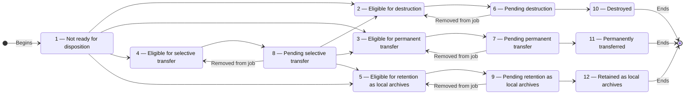

# Disposition — Product and Technical Specification

**Status:** Approved
**Prepared:** 7 October 2026
**Project:** ERMS / Wathiq
**Revision:** 1.2

## Revision history

| Revision | Date | Summary |
| --- | --- | --- |
| 0.1 | 30 September 2026 | Initial discussion draft |
| 0.2 | 6 October 2026 | Clarified the disposition actions, FSM, repeated job membership, blockers that arise during a job, termination versus completion, the one-active-job rule, destruction records, and open decisions; renamed selective-appraisal statuses to selective-transfer statuses |
| 0.3 | 6 October 2026 | Added status 13 for a mixed disposition unit whose physical material was destroyed but whose digital material must be preserved after job termination; restored termination after physical destruction; defined individual and bulk IGU recovery from status 13; defined reopening, hierarchy-change, and retention-rule recalculation behavior; required status propagation to descendants; defined the active-job requirement for pending statuses, the active/completed/terminated job lifecycle, mandatory assignment before job membership, separate final-executor records, externally supplied disposition numbers, metadata and evidence retained after destruction, per-aggregation results for multi-selection job addition, the prohibition on adding redacted disposition units, blocker enforcement during acceleration, and the single `disposition.jobs.manage` privilege |
| 1.0 | 6 October 2026 | Approved the common disposition specification after resolving all common workflow, authorization, status, hierarchy, timing, identifier, destruction-metadata, access, integrity, and verification decisions |
| 1.1 | 6 October 2026 | Relationships do not block job admission or acceleration; outside-job aggregation and record links block final disposition until authorized removal, with relationship review UI and current-state enforcement |
| 1.2 | 7 October 2026 | Defined the shared purpose-built workflow architecture and logical data model for disposition jobs, membership episodes, tasks, review rounds, decisions, document links, resource outcome fields, protected operations, and canonical SQL ownership |

## 1. Purpose

Disposition is the controlled process that starts after records have been kept
for their required retention periods. In Wathiq, disposition may result in
**destruction**,
**permanent preservation and transfer to an external archive**, **selective
transfer**, or **retention as local archives**. Destruction is one
possible disposition action; it is not synonymous with disposition.

This specification defines the rules shared by all four disposition actions.
Disposition applies to a root aggregation and everything under it. This
document covers eligibility, disposition jobs, assignment to information-
governance users, conditions that block disposition, early eligibility in
exceptional cases, local retention rules, and the information recorded when
the final action is completed.

The action-specific review, evidence, approval, and completion requirements for
destruction, permanent transfer, selective transfer, and retention as
local archives will be defined in separate specifications. Section 14 contains
the initial rules already discussed for destruction, including what happens to
metadata and to aggregations that contain both physical and digital material.
Its inclusion does not give destruction priority over the other actions. Until
the relevant action-specific specification is approved, Wathiq must not permit
a job of that type to execute its final action.

This approved specification is the product contract for requirements shared by
all disposition actions. Each action's separate specification remains the
contract for its action-specific review, evidence, approval, and execution
requirements.

For aggregation and record relationship blockers and their disposition-review
UI, see [Record and Aggregation Relationships, section 7](record-and-aggregation-relationships.md#7-disposition).

## 2. Relationship to existing Wathiq rules

1. Disposition applies to a root aggregation and everything under it. Wathiq
   does not schedule a child aggregation or record separately.
2. The effective retention rule is resolved in this order:
   - a local retention rule on the governing root aggregation; otherwise
   - the root aggregation's effective classification retention rule.
3. The due-date calculation uses the governing root's closure date plus the
   effective current and intermediate retention periods.
4. An open governing root has no disposition due date and remains not ready.
5. Legal holds work as defined in the Legal Holds specification, including
   protection inherited from a parent aggregation. When adding an aggregation
   to a disposition job and before completing the final action, Wathiq must
   determine whether an effective legal hold currently protects the
   aggregation or any descendant. It must use the current hold definitions,
   assignments, aggregation hierarchy, and server time.
6. Security blocking uses the existing `security_levels.prevents_disposition`
   policy flag.
7. Vital protection uses the effective `is_vital` value on each aggregation
   and record.
8. Existing rules for closure, permissions, security, ownership, event history,
   and protection against conflicting updates continue to apply unless this
   specification explicitly says otherwise.

## 3. Terminology

### 3.1 Information-governance user (IGU)

**IGU** means an authorized information-governance user. It is only a short
name used in this document. An IGU is authorized to perform disposition work
through the `disposition.jobs.manage` privilege granted by an
information-governance role. Calling someone an IGU does not itself grant the
privilege or access to any resource.

### 3.2 Disposition unit

A root aggregation and everything under it: child aggregations, records, and
digital components. This complete group is processed together.

### 3.3 Eligible aggregation

A root aggregation whose retention periods have ended and whose disposition
status is 2, 3, 4, or 5. Eligible does not mean ready for the final action. A
vital record, a security level, a legal hold, missing approval, missing
evidence, or an action-specific rule may still block it.

### 3.4 Due date

The root aggregation's closure timestamp plus its current and intermediate
retention periods. `date_closed` is stored as `timestamptz`, so the database
calculation produces an absolute moment in time. The scheduled service uses the
UTC value returned by the database and compares it with the database's current
timestamp. The aggregation becomes due only when the current timestamp is
strictly later than the calculated value; it does not become due at the exact
calculated instant. A user's working timezone affects only how the value is
displayed.

### 3.5 Disposition job

A group of aggregations being processed together. Every aggregation in a job
must have the same disposition action. The job tracks review, work performed
outside Wathiq, evidence, approvals, and completion of the final action. Adding
an aggregation to a job does not remove any protection from it.

### 3.6 Active, completed, and terminated jobs

A job becomes **active** when it is created. It becomes **completed** when its
final disposition action has been completed. It becomes **terminated** when an
authorized IGU terminates it before completion. These are the only job states.
Completed and terminated are different job outcomes.

An IGU with `disposition.jobs.manage` may terminate an active job at any point
in its process. Termination stops all further work in that job. It does not mark
the job as completed or claim that unfinished disposition actions occurred.
Aggregations remain members of completed and terminated jobs as permanent
history. Membership in a completed or terminated job does not count as
membership in an active job. Membership in a completed job means the
disposition unit reached status 10, 11, or 12 and cannot enter another
disposition job. Membership in a terminated job may coexist with later
membership in an active job if the unit is in an eligible status. Status 13
requires a separate resolution before the unit may enter another job.

## 4. Disposition status catalogue

Every aggregation and record has a required `disposition_status` with the
following controlled values:

| Code | Stable name | User-facing meaning |
| ---: | --- | --- |
| 1 | `not_ready` | Not ready for disposition |
| 2 | `eligible_destruction` | Eligible for destruction |
| 3 | `eligible_permanent_transfer` | Eligible for permanent transfer |
| 4 | `eligible_selective_transfer` | Eligible for selective transfer |
| 5 | `eligible_local_archives` | Eligible for retention as local archives |
| 6 | `pending_destruction` | Pending destruction |
| 7 | `pending_permanent_transfer` | Pending permanent transfer |
| 8 | `pending_selective_transfer` | Pending selective transfer |
| 9 | `pending_local_archives` | Pending retention as local archives |
| 10 | `destroyed` | Destroyed |
| 11 | `permanently_transferred` | Permanently transferred |
| 12 | `retained_local_archives` | Retained as local archives |
| 13 | `partially_disposed_action_required` | Partially disposed — action required |

Every disposition job also stores a `disposition_status` from this same
catalogue. While an aggregation belongs to an active job, the job, aggregation,
and all descendant aggregations and records must have the same disposition
status. Adding, removing, or transitioning job contents must preserve this
rule as one operation. Sections 6.1 and 12 define exceptions when reopening or
a retention-rule change recalculates a member's status while it remains in the
job.

The database accepts only these 13 values. New aggregations and records start
at status 1. Existing data also starts at status 1 unless an approved migration
can prove that a final disposition action already took place. The interface
translates the labels shown to users. The numeric codes and stable names do not
change between languages.

## 5. Finite-state machine

### 5.1 Normal valid transitions

The following are the valid transitions in the normal disposition flow:

```text
1 -> 2    1 -> 3    1 -> 4    1 -> 5
2 -> 6    3 -> 7    4 -> 8    5 -> 9
6 -> 2    7 -> 3    8 -> 4    9 -> 5
6 -> 10   7 -> 11   9 -> 12
8 -> 2    8 -> 3    8 -> 5
```



The diagram and transition list describe the normal state flow for a
disposition job and the aggregations and records it contains. When a job moves
to another disposition state, every aggregation and record currently in that
job moves to the corresponding state as part of the same operation.

Job termination is an exceptional action, not another disposition state, so it
is not shown in the diagram or added to the transition list. An authorized IGU
may terminate an active job at any point before completion. Every aggregation
remains in the terminated job, but its disposition status returns to the
eligible state that matches the job type: `6 -> 2`, `7 -> 3`, `8 -> 4`, or
`9 -> 5`. If physical destruction has been confirmed for a mixed disposition
unit but its digital material has not been destroyed, termination instead sets
that unit to status 13, **Partially disposed — action required**. Its digital
material must be preserved. Status 13 is an exception caused by termination,
not part of the normal flow shown in the diagram.

Recovery from status 13 is also handled outside the normal diagram. An
authorized IGU explicitly selects the new eligible status for each affected
aggregation: 2, 3, 4, or 5. Wathiq requires a reason and records the decision
in permanent event history. The aggregation may then be added to a new job that
matches its new eligible status.

An authorized IGU may instead resolve all status-13 aggregations in the same
terminated job in one bulk action. The IGU selects one eligible status and
provides one reason. That status and reason apply to every status-13
aggregation in the job.

Reopening is another exception outside the normal diagram. Section 6.1 defines
how reopening resets an eligible or pending disposition unit to status 1 and
blocks an active job until the aggregation is explicitly removed.

The transition from status 8 records the selective-transfer decision.
Selective transfer has no separate final status. The decision results in
destruction, permanent transfer, or retention as local archives and then
follows the workflow for that outcome.

### 5.2 Transition causes

| Transition | Cause |
| --- | --- |
| `1 -> 2/3/4/5` | Scheduled eligibility evaluation or authorized acceleration |
| `2 -> 6`, `3 -> 7`, `4 -> 8`, `5 -> 9` | Addition to a disposition job of the corresponding type |
| `6 -> 2`, `7 -> 3`, `8 -> 4`, `9 -> 5` | Removal from the disposition job before final execution |
| `8 -> 2/3/5` | Recorded and approved selective-transfer decision |
| `6 -> 10`, `7 -> 11`, `9 -> 12` | Authorized final execution after all common and action-specific gates pass |

Clients cannot set any status they choose. Each transition is made only by the
operation named in this specification. Both the server and the database check
that the transition is allowed.

### 5.3 Removal transitions

An aggregation may be removed from its disposition job at any time before
final execution. Removal restores the corresponding eligible status:

- pending destruction returns to eligible for destruction (`6 -> 2`);
- pending permanent transfer returns to eligible for permanent transfer
  (`7 -> 3`);
- pending selective transfer returns to eligible for selective transfer
  (`8 -> 4`); and
- pending retention as local archives returns to eligible for retention as
  local archives (`9 -> 5`).

The job removal and status change must either both succeed or both fail. Wathiq
records the removal in permanent event history. If the aggregation is later
added to a job again, it follows the same transition from eligible to pending.
Every addition and every removal creates a new event. A later event never
changes or deletes an earlier one, so the full history is kept.

If an aggregation was reopened while it belonged to a job, it is already in
status 1. Removing it from the job does not apply one of the eligible-state
transitions above. It removes only the active-job membership and leaves the
aggregation and its descendants in status 1. Wathiq records both the earlier
reopening and the later removal as separate permanent events.

If a retention-rule change has marked a member for removal under Section 12,
removing it changes only its active-job membership. The aggregation and its
descendants remain in the status calculated under the changed rule: status 1,
2, 3, 4, or 5. Wathiq records the rule change, recalculation, and later removal
as separate permanent events.

### 5.4 Pending status requires active-job membership

An aggregation and its descendants may enter status 6, 7, 8, or 9 only when
the root aggregation is successfully added to an active disposition job of the
matching type:

- a destruction job sets status 6;
- a permanent-transfer job sets status 7;
- a selective-transfer job sets status 8; and
- a retention-as-local-archives job sets status 9.

Adding the aggregation to the job and changing the root and every descendant
aggregation and record to the matching pending status must either both succeed
or both fail. A user, API client, scheduled service, import, background process,
or direct database operation must not set a pending status without matching
active-job membership.

A pending status always requires matching active-job membership. A member may
temporarily have a non-pending status only when it must be removed from its
active job: a reopened aggregation remains in status 1 under Section 6.1, and
a retention-rule change may leave a member in status 1 or in a non-matching
eligible status under Section 12. If the recalculated disposition action still
matches the active job, the member remains in the matching pending status.

## 6. Status scope and propagation

The governing root is the only independently evaluated and listed disposition
unit. Every aggregation and record stores its own `disposition_status` so its
current disposition state and final outcome can be reported explicitly.

The valid transitions also govern the state of a disposition job. When the job
state changes, Wathiq changes the `disposition_status` of every aggregation and
record currently contained in the job to the matching state. The job and all
of its current contents must either change together or remain unchanged, except
for the temporary reopening and retention-rule-change cases defined in Sections
6.1 and 12.

Each transition changes the status of the root aggregation and all its
descendant aggregations and records. All those changes must succeed or fail
together. This ensures that when a user finds or views the metadata of a
descendant, its stored disposition status accurately reflects what is happening
to the root disposition unit. Digital components do not store a separate
disposition status; they use the status of their record. Wathiq must never
leave only part of the group in the new status.

Every aggregation eligible for or added to a disposition job is closed.
Wathiq's existing closure rules already prohibit creating, moving, or editing
content in a closed aggregation. This specification does not create another
content-editing rule or a disposition override to the closure rules.

### 6.1 Reopening an aggregation

An authorized user may reopen an aggregation under Wathiq's existing closure
rules. Reopening clears `date_closed`. In the same operation, Wathiq resets the
root aggregation and every descendant aggregation and record to status 1,
**Not ready for disposition**.

If the aggregation belongs to an active disposition job, reopening does not
remove it from that job. The job is immediately blocked and cannot move to its
next state or complete a final action while the reopened aggregation remains a
member. The interface must clearly identify the reopened aggregation and state
that it must be removed.

An authorized IGU must explicitly remove the reopened aggregation from the
job. That removal changes only membership; the aggregation and descendants
remain in status 1. After removal, the job may continue if all its remaining
members pass the normal checks.

Wathiq records the reopening, status reset, job block, and later removal in
permanent event history. If the aggregation is closed again, it remains in
status 1 until the automatic eligibility service calculates eligibility from
the new closure date and the retention rule then in effect, or an authorized
IGU uses the exceptional acceleration process.

## 7. Automatic eligibility service

A scheduled backend service checks root aggregations in status 1. It processes
a limited number at a time and can safely continue after an interruption. It
uses the UTC calculated-disposition value returned by the database and the
database's current timestamp. It does not recalculate eligibility in a user's
working timezone.

A root qualifies only when all of the following are true:

1. it has a closure date;
2. Wathiq can find the retention rule that applies to it;
3. the database's current timestamp is strictly later than its calculated
   disposition timestamp;
4. the root and its descendants have not changed while Wathiq performs the
   update; and
5. its status remains 1.

The service maps the effective rule's `final_disposition` as follows:

| Effective final disposition | New status |
| --- | ---: |
| `destruction` | 2 |
| `transfer_to_external_archive` | 3 |
| `selective_preservation` | 4 |
| `retain_as_local_archives` | 5 |

`selective_preservation` remains the existing retention-rule value defined by
the Classification Scheme specification. In this disposition workflow, it maps
to the selective-transfer statuses 4 and 8. Renaming that existing retention
rule value is outside this specification.

Vital status, security levels, and legal holds do not stop an aggregation from
becoming eligible. They stop it from being added to a job or reaching the final
status. In this way, Wathiq shows that the retention period has ended while
also showing that disposition is currently blocked.

Running the service more than once must not create extra changes or duplicate
events. Two service processes may run at the same time, but they must not
process the same aggregation twice. Database locking, or an equally safe
method, must prevent a simultaneous close, reopen, retention-rule change,
hierarchy change, acceleration, or job action from causing a wrong transition.
For each successful transition, Wathiq permanently records the rule and dates
used in the calculation. If one aggregation fails, Wathiq continues safely and
reports the failure instead of silently skipping work.

## 8. Eligibility listing

Authorized IGUs receive a paginated list of governing root aggregations in
statuses 2 through 5. The server returns one page at a time. The browser must
not download the full list of eligible aggregations.

Each row shows at least:

- aggregation identifier/number and title;
- disposition status and final-disposition type;
- calculated due date and days overdue;
- owning organization unit;
- effective retention-rule source;
- an indication of whether the root or any descendant is vital and, when the
  user may see it, the number of blocking resources;
- an indication of whether any security level blocks disposition and, when the
  user may see it, the number of blocking resources;
- an indication of whether a legal hold applies and, when the user may see it,
  the number of blocking resources;
- a clear **Blocked from disposition job** state and the reasons the caller may
  see; and
- current active-job membership, if any.

The default order is oldest due date first. If two due dates are the same,
Wathiq uses the aggregation identifier to keep the order consistent.
The server supports filtering and sorting by owner organization unit, due date,
status/type, whether the root or a descendant is vital, whether a security
level blocks disposition, and whether a legal hold applies. Users may group
the displayed results by owner organization unit. Grouping must still work one
server-provided page at a time; the browser must not load the full list.

The design must follow Wathiq's established table pattern, include loading,
empty, and error states, and remain usable in LTR and RTL. Color is not the only
blocked-state cue.

A redacted disposition unit cannot be selected or added to a disposition job.
The listing must disable or omit its selection control and clearly state that
the user does not have enough access to add it. Knowing that a redacted unit
exists does not grant authority to act on it.

Existing security rules still apply. If a user may see the root but cannot see
a blocking descendant, Wathiq shows a redacted copy of that descendant instead
of hiding it completely. The redacted copy must make clear that a specific
descendant is blocking disposition and must show the reason it blocks
disposition:

- the descendant is marked as vital;
- its security level prevents disposition; or
- an effective legal hold protects it.

Wathiq applies its existing redaction rules to the rest of the copy.
Fields the user is not allowed to see—such as the descendant's identity or
title, the security-level details, or the legal-hold name—remain redacted. When
several inaccessible descendants block disposition, Wathiq shows a separate
redacted copy for each one so the user can see how many blocking units exist
and the reason for each blocker.

This blocker display does not make a redacted descendant selectable. Redacted
blocking descendants are shown only to explain why the visible root disposition
unit is blocked.

## 9. Common disposition blockers

A disposition unit cannot be added to a disposition job or finally executed
when any of the following applies to the root or any descendant aggregation or
record:

1. `is_vital = true`;
2. its security level has `prevents_disposition = true`; or
3. it is protected by one or more effective legal holds.

For a record protected by a hold, its digital components are protected with it.
Wathiq checks the current database values. It must not rely on values copied
into a list or saved by the browser. It repeats the checks while adding the
aggregation to a job and while completing the final action. The database must
prevent another change from slipping between the check and the update. Direct
SQL, background services, imports, and API clients cannot bypass these rules.

Aggregation and record relationships are **final-action blockers only**. They
do not prevent job admission. A link from any aggregation or record in the
disposition unit to an endpoint in a unit outside the current job blocks final
disposition until authorized removal from either endpoint, regardless of the
related unit's eligibility. This includes units in different jobs or with no
active job. Links within one unit or between units in the same job do not block
and need not be removed. Apply every relationship type in both directions, including
links on descendants, as defined in
[Record and Aggregation Relationships, section 7](record-and-aggregation-relationships.md#7-disposition).

The review UI must distinguish these final-action blockers from admission
blockers and show the relationship summary and table required by that section
to Records Officers and Records Managers. An admitted unit with outside-job
links enters its normal pending status and is marked blocked from final
disposition. Removing a link during review requires `disposition.jobs.manage`,
`relationships.link`, current view authorization on both endpoints, and a
recorded reason. Relationship privileges do not bypass access to a redacted
endpoint.

Adding or removing a relationship does not itself require repeating review
approvals. A new link to a unit outside the job blocks final execution until
removed; the server checks the current links again before execution. Other
changes remain subject to their existing approval rules.

### 9.1 Blocker arising after addition to a job

Vital status may be set, security may be upgraded to a level that prevents
disposition, or an effective legal hold may begin protecting a disposition
unit after that unit has been added to a job but before the final action.
Wathiq must allow these protective changes even when disposition is pending.
A newly created outside-job aggregation or record relationship, or a job-
membership change that makes an existing link outside-job, also blocks the
final action without removing membership or changing the pending status.

When a blocker arises after addition to a job:

1. the unit remains a member of its current disposition job;
2. its disposition status remains 6, 7, 8, or 9, as applicable; becoming
   blocked does not cause a state transition;
3. the job item is clearly marked **Blocked** and shows every blocker category
   the caller is authorized to see;
4. the final action is prohibited while any blocker remains;
5. completed review work, approvals, evidence, and all earlier event history
   remain intact; and
6. the system never automatically clears vital status, lowers security,
   releases a hold, or removes the unit from the job.

Wathiq calculates whether an item is blocked from the current resource,
security, hierarchy, legal-hold, and relationship data. Users cannot edit the blocked state,
and Wathiq must not rely on a saved copy that may become out of date. The
assigned IGU and other authorized job participants must see the blocked state
in Wathiq. Email, text messages, and other notification channels are outside
this specification.

When a user action causes a pending item to become blocked, that action creates
a permanent event-history entry. A legal hold may also become active because
its start time arrives. In that case, Wathiq records the event when it first
detects the new blocker. The event records the job, root aggregation, type of
blocker, user or system source, and time. When the event or blocker details are
shown to a user who cannot see the blocking descendant, Wathiq shows the same
redacted copy and blocker reason defined in Section 8.

### 9.2 A protective change at the same time as the final action

Immediately before every action that cannot be undone, Wathiq checks the root
and all descendants again for vital resources, security levels that prevent
disposition, direct or inherited legal holds, and outside-job aggregation and
record relationships. The final action and changes
to these protections, relationships, or related job membership must use the
same database locking rules and lock records
in the same order. This prevents a protection added at the same time from being
missed.

If a blocker exists, the final action fails and no status changes to 10, 11, or
12. The error shows only information the user is allowed to see. An IGU may
still remove the blocked aggregation from its job. Section 5.3 defines the
resulting status. The eligibility list continues to show that it is blocked.

### 9.3 Resolution of blockers

When every blocker has been lawfully resolved, the item remains in its job and
retains the same pending status. Wathiq marks it unblocked and appends a new
permanent event-history entry. Removing a blocker never starts or resumes the
final action automatically. An authorized IGU must choose to continue, and
Wathiq checks the whole group again. Existing review work, approvals, and
evidence are not deleted because the item was blocked. Any additional rules in
the specification for that disposition action still apply.

## 10. Disposition jobs

### 10.1 Common job data

Each job has at least:

- a permanent internal identifier and a job number shown to users;
- exactly one type: destruction, permanent transfer, selective transfer, or
  retention as local archives;
- one lifecycle state: active, completed, or terminated;
- the specific IGU assigned to the job, nullable only while the job is an empty
  active job is empty;
- creator and creation timestamp;
- the last user to update it, the update time, and a version number used to
  prevent one user's changes from silently overwriting another's;
- disposition-unit membership;
- common and action-specific evidence references;
- approval records; and
- immutable event history.

Assignment makes the IGU responsible for the work. It does not give the IGU
access to records they could not already access, add permissions, increase
security clearance, or expand organizational access.

### 10.1.1 Assignment to a specific IGU

A newly created active job may be unassigned only while it is empty. Before the
first aggregation is added, the job must be assigned to one specific user who
is authorized to work on that disposition job. A role cannot be the assignment
target.

The `disposition.jobs.manage` privilege and existing access rules determine who
may work on disposition jobs. Assignment identifies the individual responsible
for progressing this job. The assigned user must already have the privilege,
security clearance, and organizational access required for the job. Assignment
does not grant any of them.

Wathiq must reject adding an aggregation to an unassigned job. Reassignment
must select another specific authorized IGU and must create a permanent event-
history entry.

The assigned IGU is not automatically treated as the person who performs the
final action. Wathiq records the actual final-action executor separately under
Section 13.

### 10.2 Membership rules

1. A job contains only governing root aggregations.
2. A unit's eligible status/final disposition must match the job type.
3. The job must be assigned to one specific authorized IGU before any
   aggregation is added.
4. A disposition unit may belong to only one active disposition job at a time.
   Memberships in terminated jobs are excluded when applying this rule because
   they are permanent history, not active-job membership.
   If it already belongs to an active job, it must be removed from that job
   before it can be added to another active job. The removal follows Section
   5.3 and creates a new permanent event-history entry.
5. A disposition unit may remain a member of any number of terminated jobs.
   Those historical memberships do not prevent addition to a new active job.
   Terminating a job or adding the unit to a later job must not delete or change
   any earlier membership or event-history records.
6. A disposition unit that remains a member of a completed job has reached
   status 10, 11, or 12. It cannot be added to another active disposition job.
   Its completed-job membership and all related history remain permanent.
7. Wathiq checks all admission blockers before adding the aggregation.
   Aggregation and record relationships do not prevent addition; outside-job
   links are shown as blockers to the final action under Section 9.
8. The user must be allowed to view the root aggregation without redaction. A
   redacted root disposition unit cannot be added to a job. Redacted
   descendants shown only as blocker explanations are never selectable job
   members.
9. Wathiq prevents conflicting additions and removals and records each action.
10. Wathiq checks a selected aggregation again before adding it. If it changed
   or acquired an admission blocker after the list was displayed, Wathiq does not add it and
   explains why using only information the user may see.
11. When an IGU selects several aggregations, Wathiq checks and processes each
    one separately. It adds every valid aggregation and reports every failure.
    A failed aggregation remains unchanged and does not undo successful
    additions from the same request. Each successful addition must still add
    the membership and change the complete disposition unit to the matching
    pending status as one operation. Each failure report must explain the
    reason without revealing information the IGU is not allowed to see.
12. A unit may be removed until the final action begins. The removal and status
   change must both succeed or both fail. It returns to the matching eligible
   status under Section 5.3. The final action must either complete as one
   operation or safely continue after interruption. Removing job membership
   cannot undo a completed final action.
13. If a member aggregation is reopened, Section 6.1 applies. The job cannot
    continue until an authorized IGU explicitly removes that aggregation. The
    removal leaves its disposition status at 1.
14. If a member's effective retention rule changes, Section 12 applies. A
    matching disposition action keeps the unit in the job and in its matching
    pending status. A unit whose new due date is not yet due, or whose new
    disposition action does not match the job, must be explicitly removed
    before the job can continue.

### 10.3 Terminating a job

An IGU with `disposition.jobs.manage` may terminate any active job at any stage
before completion. Wathiq must require confirmation and a reason that is not
empty. Termination creates a permanent event-history entry and records the IGU,
time, and reason.

Termination keeps every aggregation in the terminated job as permanent
history. It resets each aggregation's disposition status to the eligible status
that matches the job type: `6 -> 2`, `7 -> 3`, `8 -> 4`, or `9 -> 5`. The job
and all membership, review, approval, evidence, and event-history records remain
available and unchanged.

There is one exception to the normal status reset. If physical destruction has
been confirmed for a mixed disposition unit but its digital material has not
been destroyed, Wathiq sets that unit and its descendants to status 13,
**Partially disposed — action required**. Wathiq must preserve all remaining
digital components and prevent their destruction. Any unit in the same job for
which no irreversible action occurred returns to status 2. Any unit that
already reached a final status remains in that final status.

Status 13 does not mean that the destruction job completed. The job remains
terminated, and the unit remains a member of it as permanent history. The unit
cannot be added to another disposition job until an authorized IGU completes
the status-13 resolution in Section 10.4.

### 10.4 Resolving status 13

An IGU with `disposition.jobs.manage` may resolve status 13 for one aggregation
or for all status-13 aggregations in one terminated job.

#### 10.4.1 Individual resolution

For one status-13 aggregation, the IGU must:

1. choose status 2, 3, 4, or 5 as the new eligible disposition status; and
2. provide a reason that is not empty.

Wathiq changes the status of the root aggregation and every descendant
aggregation and record together. The change must either fully succeed or leave
the complete unit in status 13. Wathiq records the IGU, time, previous status,
new status, reason, terminated job, physical-destruction evidence, and preserved
digital-material identifiers in permanent event history. The event history
must not contain copies of the digital content itself.

The original terminated-job membership remains unchanged. After the change,
the aggregation may be added to a new active job only when that job's type
matches the newly selected eligible status. Adding it to the new job follows
the normal eligible-to-pending transition. All current vital, security, and
legal-hold blockers still apply.

#### 10.4.2 Bulk resolution for a terminated job

The IGU may resolve every status-13 aggregation in one terminated job through
one bulk action. The IGU must:

1. choose one new eligible status—2, 3, 4, or 5—for every status-13
   aggregation in the job; and
2. provide one reason that applies to every affected aggregation.

Before making any change, Wathiq shows the number of affected root
aggregations and requires confirmation. The bulk action includes only
aggregations in status 13. It does not change aggregations in that job that are
already eligible or in a final status.

Wathiq updates every affected root and all its descendant aggregations and
records. The complete bulk action must either succeed or fail. If any affected
unit cannot be updated, no unit changes status. Wathiq reports the failure
without revealing information the IGU is not allowed to see.

Wathiq creates a permanent job-level event for the bulk action and a permanent
event for every affected aggregation. The events record the IGU, time, previous
status, selected eligible status, shared reason, terminated job, and one
identifier that links all events from the same bulk action. They also keep
references to the physical-destruction evidence and identifiers for the
preserved digital material. Event history must not contain copies of the
digital content itself.

After the bulk action succeeds, each affected aggregation may be added to a new
active job whose type matches the selected eligible status. The aggregations
remain members of the terminated job as permanent history. All current vital,
security, and legal-hold blockers still apply when they are added to a new job.

### 10.5 Work performed outside Wathiq

An assigned IGU reviews the aggregation and descendants, obtains the owning
organization-unit manager's approval and the organization's records manager's
approval, performs the required real-world activities, and records their
outcomes and evidence in Wathiq.

Wathiq records these facts, but an uploaded file or checked box does not by
itself prove that work outside Wathiq occurred. The separate specifications
will define required evidence, who may approve, approval order, rejection,
withdrawal, delegation, expiry, and controls for each disposition action.

## 11. Exceptional acceleration

An IGU with `disposition.jobs.manage` may make a root aggregation eligible
early. The aggregation moves from status 1 to status 2, 3, 4, or 5 according to
its retention rule. The IGU does not need to wait for the aggregation to close
or for its retention periods to end.

Acceleration:

- acts only on a governing root and its disposition unit;
- cannot choose an outcome different from the effective retention rule;
- requires an exceptional reason that is not empty;
- does not bypass vital, security, legal-hold, approval, evidence, or
  final-action controls;
- records the normal calculated due date when available, the source of the
  retention rule, the IGU, time, reason, and new status; and
- is clearly identified as early eligibility in history and reports.

Acceleration is prohibited while any admission blocker in Section 9 applies to the
root or any descendant aggregation or record. Before changing the status,
Wathiq must check current vital status, disposition-blocking security levels,
and direct or inherited effective legal holds. If any blocker exists, Wathiq
rejects the acceleration and leaves the complete disposition unit in status 1.
Relationships do not prevent acceleration; their final-action blockers remain
in force. Acceleration never bypasses or weakens an execution blocker.

## 12. Local retention-rule override

The existing local retention rule on a root aggregation is the local override.
The disposition job must not store a second copy. Every eligibility calculation
uses the rule currently in effect. A local rule takes priority over the rule
inherited from the classification.

Creating, changing, or removing a local rule still requires the existing
permission and a reason. This specification gives no additional user that
permission.

Whenever an aggregation's effective retention rule changes, whether because
of a local-rule change or a change to the rule it inherits, Wathiq immediately
recalculates its disposition due date and disposition action. The database's
current timestamp and the strict eligibility boundary in Section 7 apply:

- if the aggregation is open, has no calculable due date, or its calculated
  disposition timestamp is equal to or later than the database's current
  timestamp, Wathiq sets the complete disposition unit to status 1; or
- if the database's current timestamp is strictly later than its calculated
  disposition timestamp, Wathiq determines the eligible status from the
  recalculated disposition action: status 2, 3, 4, or 5.

If the aggregation does not belong to an active disposition job, Wathiq uses
that recalculated status directly.

If the aggregation already belongs to an active disposition job, the following
rules apply:

1. If the recalculated result is status 1, the aggregation remains a member of
   the job, is marked **Removal required**, and the complete disposition unit
   is set to status 1. The job cannot move to another state or perform its
   final action until an authorized IGU explicitly removes the aggregation.
2. If the database's current timestamp is strictly later than the recalculated
   disposition timestamp and the recalculated disposition action matches the
   job type, the aggregation remains in the job and remains in the matching
   pending status: 6, 7, 8, or 9. It is not marked for removal, and the job may
   continue.
3. If the database's current timestamp is strictly later than the recalculated
   disposition timestamp but the recalculated disposition action does not
   match the job type, the aggregation remains a member of the job, is marked
   **Removal required**, and the complete disposition unit is set to the new
   eligible status: 2, 3, 4, or 5. The job cannot move to another state or
   perform its final action until an authorized IGU explicitly removes the
   aggregation.

Removal under item 1 or 3 changes only active-job membership and preserves the
recalculated status. After removal, the job may continue if all remaining
members pass the normal checks.

The rule change, due-date and action recalculation, status decision, job-type
comparison, any **Removal required** mark, and any resulting job block must be
saved together. Wathiq records the previous and new rule source, due date,
disposition action, and status; the user, time, and reason for the rule change;
and whether the unit's action matched its active job. No existing job,
membership, or event-history record is deleted or changed.

### 12.1 Hierarchy changes

An authorized hierarchy change is allowed while an aggregation is eligible or
belongs to an active disposition job. Before committing the change, Wathiq
determines the aggregation's effective retention rule before and after the
change.

If the hierarchy change does not alter the effective retention rule, Wathiq
leaves the aggregation's disposition status and active-job membership
unchanged. If the hierarchy change alters the effective retention rule, Wathiq
applies all recalculation, complete-unit update, active-job matching, required
removal, job blocking, and event-history rules in this section. These safeguards
apply both before and after the aggregation has been added to a job.

An authorized IGU may change an aggregation's retention rule while reviewing
it in a disposition job when the change is warranted. The IGU must provide a
reason, and the retention-rule change still requires the existing
retention-rule administration privilege because it is a policy change. The
`disposition.jobs.manage` privilege alone does not authorize it. After the
change, Wathiq applies the recalculation and active-job rules above.

## 13. Information recorded after the final action

When the final action succeeds, Wathiq sets the following values on the root
aggregation and every descendant aggregation and record. The whole update must
either succeed together or safely continue after an interruption as one final
outcome:

- the applicable terminal `disposition_status` (10, 11, or 12);
- `final_disposition_at` as a server-assigned `timestamptz`;
- `final_disposition_by_user_id`, referencing the IGU who executed the action;
- `disposition_job_id`; and
- the identifier that links the change to its permanent event-history entry.

Wathiq also records the following on the job and, where applicable, on every
affected aggregation and record:

- the stable user ID of the authenticated IGU who actually performs the final
  action in Wathiq;
- that user's display name at the time of execution;
- the server-recorded execution date and time;
- the disposition job ID;
- the resulting disposition status;
- the destruction number or transfer number, where applicable;
- the event-history identifier; and
- every action-specific confirmation and evidence reference required by the
  relevant specification.

The final-action executor may be different from the IGU assigned to the job.
The executor must independently have `disposition.jobs.manage` and the security
clearance and organizational access required at the time of execution. Wathiq
must record the authenticated user who performs the final-action operation. It
must not substitute the assigned IGU, a role, or a service account as the
executor.

Status 10 also requires a unique destruction number. Status 11 also requires a
unique transfer number. These values are supplied by the external archival
authority; Wathiq does not generate, allocate, or control them. Each value is
free-format text that may contain letters, numbers, and special characters and
must not exceed 20 characters. Wathiq stores the value exactly as supplied and
enforces the applicable uniqueness requirement. Status 12 has no extra number.

The history must still identify the executor if that user is later renamed or
deactivated. Wathiq keeps both the stable user reference and the display name
captured at the time of execution.

Before completing the final action, the server checks the job type, membership,
status, assigned user, `disposition.jobs.manage`, required approvals and
evidence, all blockers, and record versions. If any check fails, no resource
status changes.

## 14. Destruction outcome

If a partially completed destruction job is terminated and an unfinished unit
enters a new job, retain links to units already destroyed in the former job as
historical evidence. Those links do not block later destruction of the
unfinished unit. Links to live resources continue to follow the normal
relationship-blocking rules. Retained evidence remains protected and does not
provide ordinary navigation to destroyed resources.


If destruction stops after some work has completed, preserve that progress and
allow an authorized retry or resumption of unfinished work in the same job.
Do not repeat completed destruction or mark the job complete early. Retained
links between units in that job do not block resumption merely because one
linked unit finished first. Recheck current authority and final-action blockers
before resuming, as detailed in the destruction extension.

### 14.1 Meaning of destruction

Destruction means disposing of the records content so that it cannot be
recovered through Wathiq. It covers every physical and digital medium in the
group. Hiding a database row, removing a link, expiring a download URL, or
setting status 10 is not destruction by itself.

For digital material, destruction covers the original component files and all
copies managed by Wathiq within the approved scope. Search text, previews,
thumbnails, temporary processing files, and caches must no longer reveal the
destroyed content. Wathiq must not claim that data has been erased immediately
from backup media managed by Wathiq when it can only guarantee removal through
the normal backup-expiry process.

When a destruction job is completed, Wathiq shows the IGU a warning that any
backups or copies held outside Wathiq must also be destroyed. The warning must
also state that ensuring the destruction of those external backups and copies
is outside Wathiq's responsibility.

For physical material, Wathiq records that an authorized person confirmed the
destruction and supplied the required evidence. Wathiq cannot itself verify a
physical act performed outside the system.

### 14.2 Metadata retained after destruction

Wathiq removes the records content but keeps a limited permanent disposition
record for each destroyed aggregation and record. The permanent record contains:

- Wathiq's stable resource identifier and the resource type;
- final disposition status 10, **Destroyed**;
- enough of the former hierarchy to establish which disposition unit contained
  the resource;
- the classification and owning organization unit at the time of destruction;
- the closure date and calculated disposition due date;
- a snapshot or reference that identifies the retention rule applied;
- any acceleration or retention-rule override and its recorded reason;
- the destruction job identifier and job type;
- the externally supplied destruction number;
- the final-destruction date and time;
- the stable user identifier and execution-time name of the IGU who executed
  the final action;
- whether the resource was physical, digital, or mixed;
- the separate physical- and digital-destruction confirmations where
  applicable;
- the destruction method, confirmation time, and confirming user;
- approval decisions, approvers, decision times, and reasons;
- identifiers, provenance, and descriptive metadata for destruction evidence;
- the permanent disposition event history;
- retained aggregation and record relationships within the same disposition
  unit or job, including endpoint identifiers, relationship type, and direction;
- a manifest containing resource identifiers, counts, media information, and
  checksums where needed to prove what was destroyed without retaining the
  destroyed content; and
- the security level and access restrictions that applied when destruction
  occurred, so the retained information remains appropriately protected.

An aggregation or record number, title, former parent identifier or hierarchy
path, original filename, or other limited descriptive metadata may remain only
when it is necessary to identify reliably what was destroyed. Wathiq must not
retain these fields merely because they existed before destruction.

Uploaded approval documents, destruction certificates, photographs or videos
of physical destruction, correspondence with the external archival authority,
and other supporting evidence files are retained for the period required by
the approved evidence-retention policy. If an evidence file is later deleted
under that policy, Wathiq permanently retains its identifier, provenance,
descriptive metadata, deletion date, deletion authority, and deletion event.

Wathiq must not retain:

- record content or digital component files;
- copies, downloadable renditions, or working copies of the destroyed content;
- OCR or other extracted text;
- search-index content;
- previews or thumbnails;
- temporary processing files or cached copies;
- access links or storage locations that imply the destroyed content remains
  recoverable; or
- free-text descriptions, notes, personal information, or other metadata that
  is not needed to identify the destroyed material or prove and explain its
  authorized disposition.

Event messages, evidence descriptions, and manifest fields must not contain a
copy or extract of the destroyed content.

Destroyed resources and their retained disposition records do not appear as
live resources in ordinary search, browse, or hierarchy views. A user with
`disposition.jobs.manage` may view a retained record through the disposition
view only when the user's existing security clearance and organizational access
also permit it. A user with the applicable audit privilege may view it through
the audit view subject to the same access restrictions. Assignment to the
former job does not grant access, and a system administrator does not receive
access merely by being an administrator. Evidence files may have narrower
access than the retained disposition record.

The remaining database rows are read-only records of destroyed resources. They
cannot be reopened, reclassified, moved, restored, added to another job, used
as a parent, or changed back into live resources.

### 14.3 Mixed-medium destruction sequence

For a mixed disposition unit:

1. physical destruction is confirmed first with actor, timestamp, method, and
   required evidence;
2. Wathiq records the physical confirmation without setting terminal status 10;
3. digital destruction may proceed only after that confirmation commits;
4. digital destruction records its own actor, timestamp, outcome, and evidence;
5. status 10 and the common final-execution fields are set only after both
   required medium outcomes succeed.

If digital destruction fails, the job remains pending destruction. Wathiq must
clearly show that physical destruction is complete and digital destruction is
not. Retrying must be safe and must not create duplicate results. Wathiq must
not suggest that the physical material still exists. The destruction-specific
specification must define recovery, verification, storage cleanup, evidence
from external systems, and backup expiry.

If a vital designation, disposition-preventing security level, or effective
legal hold arises after physical destruction is confirmed but before digital
destruction completes, Wathiq must stop before digital destruction. The unit
remains in the destruction job with status 6 and is marked both **Blocked** and
**Partially destroyed**. Wathiq preserves the physical-destruction confirmation
and complete event history. It clearly states that the physical destruction
cannot be undone. Removing the blocker does not automatically start digital
destruction.

An authorized IGU may terminate the job while it is in this condition.
Termination preserves the digital material and sets the affected unit and its
descendants to status 13, **Partially disposed — action required**. The
destruction-specific specification must define how an authorized user resolves
this exceptional status and records the final treatment of the preserved
digital material.

## 15. Authorization and separation of duties

Wathiq uses one global privilege for disposition-job management:
`disposition.jobs.manage`. This privilege is granted through an
information-governance role. It covers:

- viewing the eligibility queue and visible blocker summaries;
- creating and editing jobs;
- admitting and removing disposition units;
- assigning/reassigning a job;
- terminating an active job;
- resolving status 13 and selecting its new eligible disposition status;
- resolving all status-13 aggregations in one terminated job through a bulk
  action;
- accelerating eligibility;
- recording evidence and real-world outcomes;
- approving on behalf of an owning organization unit;
- approving as the organization's records manager;
- recording selective-transfer decisions; and
- executing each final disposition action.

Removing a relationship during disposition review additionally requires
`relationships.link`, view authorization on both endpoints, and a recorded
reason, as specified in Section 9. `disposition.jobs.manage` alone does not
authorize link removal.

Retention-rule administration, including creating, changing, or removing a
local retention-rule override, is policy management rather than disposition
execution. It remains protected by its existing privilege and is not included
in `disposition.jobs.manage`.

The `disposition.jobs.manage` privilege does not grant access to an
aggregation, record, component, or concealed metadata; raise a user's security
clearance; expand organizational access; or bypass a vital, security-level, or
legal-hold blocker. Every operation remains subject to the user's current
resource access, security clearance, organizational access, and all rules in
this specification. Assigning a job to a user does not grant the privilege or
any of those forms of access.

Separation of duties is enforced through the workflow requirements defined by
this specification and the four action-specific specifications, not by
creating a separate privilege for each duty or job type. Those specifications
must define whether the same IGU may prepare, approve, and complete a job. A
system administrator does not receive `disposition.jobs.manage` or bypass
record security merely by being an administrator.

## 16. Audit, reporting, and data integrity

Permanent event history must record at least:

- every status transition with source and reason;
- the due date and the copy of the retention rule used for automatic
  eligibility;
- acceleration and its exceptional reason;
- job creation, type, membership addition/removal, assignment, reassignment,
  completion, and termination reason;
- blocker detection when addition or a final action is rejected, a blocker arising
  during pending disposition, and resolution of all blockers, without leaking
  concealed details;
- evidence addition/replacement and approval decisions;
- selective-transfer decision;
- physical and digital destruction confirmations;
- status-13 creation and resolution, including the IGU's selected eligible
  status and reason, and the shared reason and bulk-action identifier when the
  resolution is performed in bulk;
- reopening an eligible or pending aggregation, resetting its disposition unit
  to status 1, blocking its job, and later removing it from the job;
- an effective retention-rule change, its previous and new rule source, due
  date, disposition action, and status, whether the new action matched the
  active job, any required-removal job block, and the later explicit removal;
- a hierarchy change, whether it changed the effective retention rule, and any
  resulting recalculation, status decision, required removal, or job block;
- the actual final-action executor's stable user ID, execution-time display
  name, execution time, authority checks, resulting status, job ID, applicable
  destruction or transfer number, confirmations, and evidence references;
- final-action identifiers and outcome; and
- failed or partly completed final actions.

Database rules must prevent invalid status transitions, adding an aggregation
to the wrong type of job, current membership in more than one active job,
missing or inconsistent final fields, and changing only part of a disposition
unit. The one-active-job check must exclude memberships in terminated jobs. A
separate rule must prevent any unit in final status 10, 11, or 12, or that is a
member of a completed job, from entering another active job. Historical
memberships in terminated and completed jobs remain permanent. Each protected
operation must follow Wathiq's existing database authorization pattern. A
client cannot bypass these checks by sending the fields through a general
update request.

Every disposition-job operation listed in Section 15 requires
`disposition.jobs.manage`, including operations performed through the API,
imports, and background processes acting for a user. The privilege does not
replace resource access, security-clearance, organizational-access, or blocker
checks. Retention-rule administration continues to require its existing
privilege and is not authorized by `disposition.jobs.manage`.

The database must also prevent status 6, 7, 8, or 9 unless the root aggregation
belongs to one active job of the matching type. Adding active-job membership
and setting the matching pending status on the complete disposition unit must
be one operation. The reopening exception may leave a status-1 unit in an
active job only until its required explicit removal. A retention-rule change
may leave a status-1 or non-matching eligible unit in an active job only while
it is marked for required removal. If the recalculated action still matches
the job, the complete unit must retain the matching pending status. None of
these cases permits a pending status without matching active-job membership.

The database and API must reject the first membership addition to a job unless
that job is assigned to one specific authorized IGU. A role identifier cannot
be stored as the assignee. Final-action records must identify the authenticated
human IGU who performed the operation and must not derive the executor from the
assignee, a role, or a service account.

For a request that selects several aggregations, the API must return a result
for each selected aggregation. A validation or update failure for one
aggregation must leave that aggregation unchanged but must not roll back other
successful additions. Each successful aggregation addition remains a complete
membership-and-status operation. Failure results must follow the redaction
rules in Section 8.

The API and database authorization path must reject adding a redacted root
disposition unit to a job. The check uses the requesting user's current access
at the time of addition. A hidden or disabled selection control is not enough;
API calls, imports, background processes acting for a user, and direct attempts
to create membership must not bypass the rule. The rejection must not reveal
the redacted unit's protected metadata.

A separate database rule must prevent a unit in status 13 from entering any
disposition job until an authorized IGU resolves it to status 2, 3, 4, or 5
with a reason. Terminating a job after physical destruction must set status 13
and preserve the remaining digital components as one operation. Resolving
status 13 must update the full disposition unit and record its event history as
one operation.

A bulk status-13 resolution must target one terminated job and every status-13
unit in that job. It must apply one selected eligible status and one shared
reason to all of them. All affected units and their descendants must change
together or remain unchanged.

Reopening an eligible or pending aggregation must clear `date_closed` and reset
the complete disposition unit to status 1 as one operation. If the aggregation
belongs to an active job, the database must prevent that job from moving to
another state or completing a final action until the aggregation is explicitly
removed.

Recalculating an effective retention rule must update the complete disposition
unit and its event history as one operation. For a member of an active job, a
matching action must preserve the matching pending status. A result of status 1
or a non-matching eligible action must mark the member for removal and must
prevent the job from moving to another state or performing its final action
until an authorized IGU explicitly removes it.

An authorized hierarchy change must compare the effective retention rule
before and after the change. If the rule is unchanged, the operation must
preserve the disposition status and job membership. If the rule changes, the
hierarchy change and every update required by Section 12 must succeed or fail
together.

## 17. Shared workflow architecture and logical data model

### 17.1 Purpose-built workflow

Wathiq does not require an embedded or general-purpose workflow engine for
disposition. The workflow is a purpose-built application service using the
states, stages, tasks, validations, and transitions approved in this
specification and the action-specific specifications.

The implementation consists of:

- relational PostgreSQL tables holding authoritative workflow state;
- database constraints, triggers, and protected transaction functions enforcing
  invariants that must not be bypassed by another client;
- application services authorizing and coordinating permitted operations;
- bounded background workers for eligibility, reminders, document generation,
  and long-running final actions; and
- the disposition task inbox and action-specific user interfaces.

Workflow stages are controlled values in application code and database
validation. They are not administrator-authored process definitions, BPMN, or
scripts stored in a generic workflow runtime.

### 17.2 Existing resource tables

`aggregations` and `records` each store the common outcome fields required by
this specification:

| Field | Requirement |
| --- | --- |
| `disposition_status` | Required controlled status 1–13; defaults to 1 |
| `final_disposition_at` | Server timestamp of the completed final action; null before completion |
| `final_disposition_by_user_id` | Stable reference to the authenticated final-action executor |
| `disposition_job_id` | Completed job that produced the final outcome; null before completion |
| `destruction_number` | Externally supplied destruction number where status is 10 |
| `transfer_number` | Externally supplied transfer number where status is 11 |

The database enforces complete and consistent terminal fields. Status and final
fields cannot be changed through ordinary resource metadata updates.

### 17.3 `disposition_jobs`

One row represents one disposition job. Its logical fields include:

- permanent identifier and unique user-facing job number;
- job type: destruction, permanent transfer, selective transfer, or retention
  as local archives;
- lifecycle state: active, completed, or terminated;
- controlled action-specific workflow stage;
- current disposition status;
- owning organizational unit where required by the action-specific
  specification;
- assigned IGU, nullable only while the active job is empty;
- current review-round number where the workflow uses rounds;
- creator and creation timestamp;
- completion actor and timestamp;
- termination actor, timestamp, and reason;
- optimistic-concurrency version and last-update information.

Constraints enforce valid job type, lifecycle state, disposition status, and
completion or termination fields. A completed or terminated job cannot return
to active.

### 17.4 `disposition_job_memberships`

One row represents one membership episode between a governing root and a job.
Removing and later re-adding the same root creates another episode rather than
overwriting the earlier one. Logical fields include:

- job and governing-root identifiers;
- membership state: active, removed, terminated history, or completed history;
- addition actor and timestamp;
- removal actor, timestamp, and reason where applicable; and
- optimistic-concurrency version.

A partial uniqueness rule permits at most one active membership for a governing
root. Protected operations keep membership and complete-unit status changes in
one transaction. Removed, terminated, and completed membership episodes remain
available as history.

### 17.5 `disposition_tasks`

One row represents one actionable task. This is the shared data source for
**My tasks**. Logical fields include:

- job, task type, workflow stage, and review round where applicable;
- task state: open, claimed, completed, or cancelled;
- exactly one initial destination: a specific user or a role queue;
- claimant and claim timestamp;
- completion actor and timestamp;
- release or reassignment information;
- priority, creation timestamp, and optimistic-concurrency version.

A protected claim operation permits only one eligible person to claim a shared
task. Eligibility and resource access are checked again for every mutation and
completion. Releasing, reassigning, losing eligibility, completing, or
cancelling a task preserves its event history. Action-specific specifications
define their task types, forms, routing, and completion rules.

### 17.6 `disposition_review_rounds` and `disposition_review_decisions`

Workflows that require repeated review use these shared tables.

`disposition_review_rounds` records the job, positive round number, actor and
start time, completion or invalidation time and reason, and a hash or equivalent
immutable reference to the reviewed membership and versions.

`disposition_review_decisions` records the round, controlled review stage,
decision, task, authenticated user, acting role, reason where required,
decision time, and reviewed membership snapshot. An action-specific
specification defines its permitted stages, decisions, ordering, and whether a
stage may be repeated.

### 17.7 `disposition_job_documents`

This shared table links uploaded or generated documents to a job and, where
required, to the governed Wathiq record and digital component created for that
document. Logical fields include:

- job and action-specific document-type code;
- document state: generating, available, or failed;
- review round where applicable;
- governed record and digital-component references;
- generating or uploading user;
- creation timestamp, content checksum, template version, and optimistic-
  concurrency version.

Action-specific specifications define required document types, templates,
storage destinations, evidence rules, and the transaction boundary between the
job evidence and governed record.

### 17.8 Shared protected operations and integrity

At minimum, protected operations cover job creation, membership addition and
removal, assignment, task claim/release/reassignment, review submission, status
transition, termination, status-13 resolution, and final completion. They must
not be implemented as unrestricted table CRUD.

The database and service together enforce:

- the finite-state rules and action-specific stage transitions;
- one active job per governing root;
- pending status only with a matching active membership;
- complete-unit propagation and all-or-nothing updates;
- immutable historical memberships, reviews, tasks, documents, and events;
- current authorization, access, blocker, and version checks;
- idempotency for retried commands and background work; and
- durable, attributable event history for every protected operation.

### 17.9 Canonical SQL ownership

The logical model in the specifications is the product contract. When
implementation is authorized, exact executable PostgreSQL belongs in:

- `database/schema.sql`, which contains the complete self-contained latest
  schema for a new empty database; and
- a new migration that upgrades an existing database containing data.

The schema and migration repeat the required DDL independently. Neither common
nor action-specific prose specifications duplicate a second executable schema.
Action-specific tables remain in their extension specification until another
approved workflow proves that their semantics are genuinely shared; expected
future reuse alone is not enough to move them into this common model.

## 18. Verification and traceability

Implementation is not complete until every approved requirement is linked to
the code that implements it and the tests that prove it. The following tests
are required at a minimum:

| ID | Requirement | Minimum verification |
| --- | --- | --- |
| DISP-01 | Controlled statuses and allowed transitions | Database constraint/trigger and API tests |
| DISP-02 | The root and every descendant change status together, and descendant metadata shows the status of the root disposition unit | Disposable-database hierarchy, rollback, search, browse, and metadata-view tests |
| DISP-03 | Due-date mapping and the strict eligibility boundary use the UTC calculated-disposition value and current timestamp returned by the database; user timezone affects display only | Clock-controlled database and service tests across UTC boundaries and leap years, plus display-timezone tests |
| DISP-04 | Open roots remain status 1 | Service and database tests |
| DISP-05 | Local rule takes precedence | Rule-resolution and rescheduling tests |
| DISP-06 | The eligibility service works in limited batches, is safe to repeat, and handles simultaneous changes | Disposable-database concurrency tests |
| DISP-07 | The server provides the list one page at a time, with correct filters, sorting, and redacted representations of inaccessible blocking descendants | API authorization and live-browser LTR/RTL tests |
| DISP-08 | Vital descendants block addition to a job and the final action, with a visible reason even when the descendant is redacted | Disposable-database hierarchy and redaction tests |
| DISP-09 | A security level can block addition to a job and the final action, with a visible reason but protected security details redacted | Disposable-database authorization and redaction tests |
| DISP-10 | Direct and inherited legal holds block addition to a job and the final action, with a visible reason but protected hold details redacted | Disposable-database hold-boundary and redaction tests |
| DISP-11 | An aggregation can be in only one active job of the correct type, must leave that active job before joining another, may remain a member of terminated jobs, and can never join another job after completion | Database uniqueness, simultaneous-addition, removal, terminated-membership, and final-status tests |
| DISP-12 | Assignment grants responsibility, not access | Authorization tests |
| DISP-13 | Acceleration follows the effective disposition action, requires a reason, and is rejected without a status change when any vital, security, or legal-hold blocker applies to the root or a descendant | API, disposable-database blocker, concurrency, and event-history tests |
| DISP-14 | Final fields and identifiers are complete and consistent | All-or-nothing update and rollback tests |
| DISP-15 | Mixed destruction confirms physical before digital | Workflow, retry, and partial-failure tests |
| DISP-16 | Destroyed content and prohibited derivatives are removed; the approved permanent disposition record remains auditable, read-only, excluded from ordinary resource views, and protected by both privilege and existing access rules | Storage, search/index, browse, hierarchy, API, authorization-intersection, immutability, metadata-minimization, and event-content tests |
| DISP-17 | Direct SQL/background paths cannot bypass protections | Disposable-database enforcement tests |
| DISP-18 | A blocker arising after addition preserves job membership, pending status, work, evidence, approvals, and history while preventing the final action | Disposable-database workflow and UI tests |
| DISP-19 | A protective change cannot be missed during the final action, and removing a blocker does not automatically continue the action | Disposable-database simultaneous-change and explicit-resume tests |
| DISP-20 | A blocker arising between mixed-medium physical and digital destruction stops digital destruction and preserves the partial outcome | Destruction workflow and recovery tests |
| DISP-21 | An authorized IGU may terminate an active job at any stage before completion; every aggregation remains in the terminated job, unaffected units return to the matching eligible state, and all history is preserved | Authorization, workflow, state-transition, terminated-membership, and event-history tests |
| DISP-22 | Terminating a destruction job after physical destruction but before digital destruction sets the affected mixed unit to status 13 and preserves its digital material; an authorized IGU may then select status 2, 3, 4, or 5 with a required reason, after which the unit may enter a matching new job | Authorization, database, full-unit update, digital-content, job-admission, UI, and event-history tests |
| DISP-23 | An authorized IGU may resolve every status-13 aggregation in one terminated job through one all-or-nothing bulk action using one selected eligible status and one shared reason | Authorization, database rollback, full-unit update, UI confirmation, job-admission, and linked event-history tests |
| DISP-24 | Reopening an eligible or pending aggregation clears its closure date, resets the complete unit to status 1, blocks any active job until explicit removal, and keeps the unit at status 1 after removal | Authorization, database rollback, job-blocking, UI, reclosure, recalculation, and event-history tests |
| DISP-25 | Status 6, 7, 8, or 9 is possible only with membership in one active job of the matching type, and job addition and full-unit status change succeed or fail together | Database constraint/trigger, direct-SQL bypass, API, import/background-path, concurrency, and rollback tests |
| DISP-26 | A newly created active job may be unassigned only while it is empty; its assignee is one specific authorized IGU, and the actual authenticated IGU who performs the final action is recorded separately with execution-time identity and action details | Authorization, assignment/reassignment, database/API rejection, executor-versus-assignee, service-account rejection, and event-history tests |
| DISP-27 | A multi-selection request adds every valid aggregation, leaves each failed aggregation unchanged, preserves successful additions when another selection fails, and reports each result without exposing protected information | API mixed-result, per-item rollback, concurrency, redaction, and UI tests |
| DISP-28 | A redacted root disposition unit cannot be selected or added to a job through the UI, API, import, background, or direct-membership path, while redacted descendants remain visible only as blocker explanations | Authorization, API, direct-database enforcement, import/background-path, redaction, and live-browser tests |
| DISP-29 | An effective retention-rule change recalculates the due date, action, and complete-unit status; an active-job member keeps status 6, 7, 8, or 9 when its action still matches, while a not-yet-due or non-matching member is marked for explicit removal and blocks job progress | Clock-controlled boundary, rule-resolution, full-unit rollback, matching and non-matching active-job, job-blocking, explicit-removal, and event-history tests |
| DISP-30 | Completing a destruction job warns the IGU that backups and copies held outside Wathiq must also be destroyed and that ensuring their destruction is outside Wathiq's responsibility | Destruction-completion workflow and live-browser LTR/RTL tests |
| DISP-31 | Every disposition-job duty in Section 15 requires `disposition.jobs.manage`; removing relationship links also requires `relationships.link`; these privileges do not grant resource access or bypass blockers; retention-rule administration remains controlled by its existing privilege | Privilege catalogue, role-grant, API, direct-database authorization, access-intersection, blocker, and retention-rule negative tests |
| DISP-32 | A hierarchy change that preserves the effective retention rule preserves disposition status and job membership; a hierarchy change that alters the rule applies the complete recalculation and active-job handling in Section 12 | Authorized hierarchy-change, effective-rule comparison, matching and non-matching job, rollback, job-blocking, and event-history tests |
| DISP-33 | Destruction and transfer numbers are unique externally supplied values, accept letters, numbers, and special characters, contain at most 20 characters, and are never generated or allocated by Wathiq | Boundary, character-preservation, uniqueness, API, database, and final-action tests |
| DISP-34 | A job is active upon creation, completed only when its final action completes, and terminated only when an authorized IGU terminates it before completion | Job-creation, completion, termination, invalid-transition, API, database, and event-history tests |
| DISP-35 | Supporting destruction evidence follows the approved evidence-retention policy, while its identifier, provenance, descriptive metadata, deletion details, and deletion event remain permanent | Retention-expiry, evidence deletion, audit-history, authorization, and rollback tests |
| DISP-36 | Aggregation and record relationships allow job admission and acceleration but outside-job links block final disposition until authorized removal, regardless of eligibility; links within one unit or the same job do not block or require removal; removal from either endpoint clears the link blocker for both units | Admission, acceleration, descendant, both-direction, all-type, same-job, authorization, redaction, audit, removal-refresh, concurrency, and live-browser Officer/Manager review tests |
| DISP-37 | Shared jobs enforce controlled type, lifecycle, action-specific stage, assignment, status, completion, termination, and optimistic-concurrency fields without a generic workflow engine | Schema, constraint, transition, API, and stale-version tests |
| DISP-38 | Membership episodes preserve every addition and removal and permit no more than one active job per governing root | Partial-uniqueness, repeated-membership, termination, completion, concurrency, and history tests |
| DISP-39 | Shared tasks support exactly one user or role-queue destination, atomic claiming, release, reassignment, eligibility loss, completion, and immutable history | Constraint, simultaneous-claim, authorization-change, reassignment, API, and event-history tests |
| DISP-40 | Review rounds and decisions preserve ordered rounds, membership/version snapshots, stage decisions, actors, acting roles, invalidation, and history | Snapshot, repeat-round, stale-membership, invalidation, authorization, and history tests |
| DISP-41 | Shared document links connect job evidence to governed records and components with controlled state, provenance, checksums, and action-defined transaction boundaries | Upload, generation, governed-record, failure, retry, authorization, and rollback tests |
| DISP-42 | Common protected operations cannot be bypassed through general CRUD or direct SQL, and canonical schema and migration produce equivalent logical structures and constraints | API negative, direct-database, schema-from-empty, migration, catalogue-parity, and rollback tests |

Every database-backed test must use a newly created disposable PostgreSQL
database initialized from the canonical schema or required migration path and
must drop that database after the run, including after failure.
